# PROJECT 15: AWS SOLUTION FOR 2 COMPANY WEBSITES USING A REVERSE PROXY TECHNOLOGY

## Step 1: Setup a Virtual Private Cloud

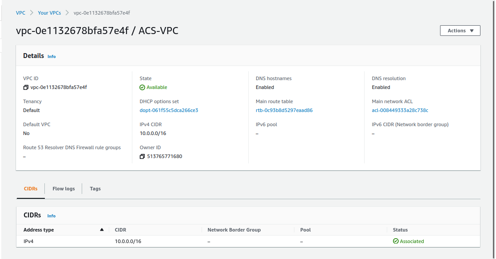

- Create a VPC using a large enough CIDR block (/16) & enable DNS hostnames

- Create subnets as shown in the diagram above. For the public subnet, we create 2 subnets in availability zone A and B respectively and for the private subnet we create 4 subnets.

* Create a route table and associate it with the public subnets
  - Select the route table you created, click Actions on the top and click 'Edit Subnet associations'
  - Select the public subnets and click save
* Create a route table for the private subnets
  - Repeat the steps above
* Create an Internet Gateway, select it and click Actions, then click Attach to VPC and attach it to the VPC you created
* Add a new route to your public subnet route table

  - Select the route table, click Actions and 'Edit routes'
  - For destination, enter 0.0.0.0/0
  - For target, select Internet Gateway and click the Internet Gateway you created

  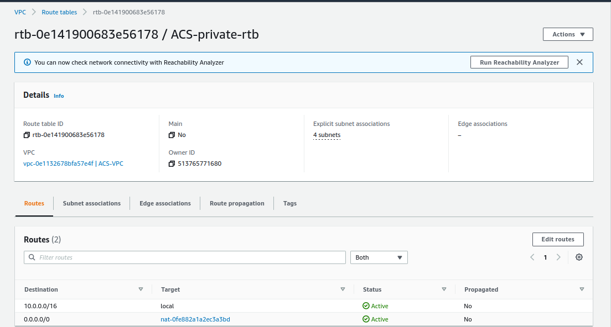

  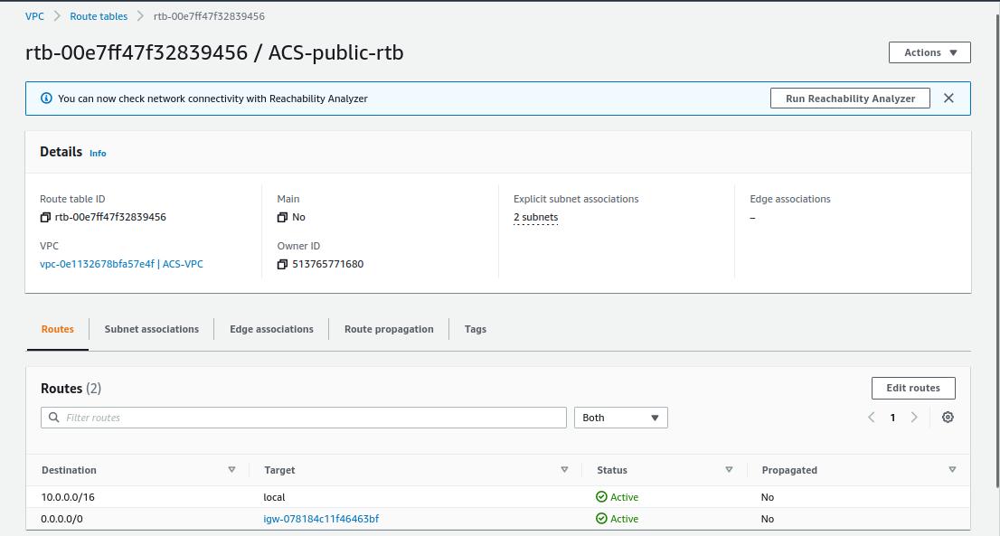

* Create an Elastic IP address that will be used by the NAT-Gateway
* Create a NAT Gateway for your private subnets (create one in each public subnet)and attach the Elastic IP created

* Add a new route to your private route table with destination as 0.0.0.0/0 and target as the NAT Gateway you created
* Associcate route table with subnets

* Create a security group for:

  - Application Load Balancer: ALB should be open to the internet
  - Bastion servers: Access to bastion servers should only be from the IPs of your workstation
  - Nginx servers: Access to nginx servers should only be from the Application Load Balancer and bastion
  - Internal lb: Allow access to nginx servers
  - Webservers: Webservers should only be accessible from the Nginx servers and bastion
  - Data Layer: This comprises the RDS and EFS servers. Traffic from Bastion (Mysql), Webserver (NFS and Mysql).

  

## Step 2: Proceed with Compute Resources

Create Autoscaling group : The two requirements are Launch Templates and Load Balancers. The Launch Templates requires AMI and Userdata while the Load balancer requires target goup

The following steps below must take place before creating the Autoscaling group

# Step 2a: Setup Compute Resources for Nginx

- Provision an EC2 Instances for Nginx, bastion and webserver
  - Create a t2.micro RHEL 8 instance in any of your two public AZs
  - Install the following packages

```
yum install -y https://dl.fedoraproject.org/pub/epel/epel-release-latest-8.noarch.rpm
yum install -y dnf-utils http://rpms.remirepo.net/enterprise/remi-release-8.rpm
yum install wget vim python3 telnet htop git mysql net-tools chrony -y
systemctl start chronyd
systemctl enable chronyd
```

- Disable senten so that our servers can function properly on all the redhat instance (nginx & webserver only)

```
setsebool -P httpd_can_network_connect=1
setsebool -P httpd_can_network_connect_db=1
setsebool -P httpd_execmem=1
setsebool -P httpd_use_nfs 1
```

- Install Amazon efs utils for mounting targets on the elastic file system (Nginx & webserver only)

```
git clone https://github.com/aws/efs-utils
cd efs-utils
yum install -y make
yum install -y rpm-build
make rpm
yum install -y  ./build/amazon-efs-utils*rpm
```

- Install self signed certificate on nginx

* _The reason we are installing this is because the load balancer will be sending traffic to the webserver via port 443 and also listen on port 443 thus for the connection to be secured we need a self signed certificate on the nginx instance_

- _Make sure you enter the private IPv4 dns of the instance_

```
sudo mkdir /etc/ssl/private
sudo chmod 700 /etc/ssl/private
openssl req -x509 -nodes -days 365 -newkey rsa:2048 -keyout /etc/ssl/private/ACS.key -out /etc/ssl/certs/ACS.crt
sudo openssl dhparam -out /etc/ssl/certs/dhparam.pem 2048
```

- confirm if the ACS.crt and ACS.key file exist
  

- Install self signed certificate for the webserver

```
yum install -y mod_ssl
openssl req -newkey rsa:2048 -nodes -keyout /etc/pki/tls/private/ACS.key -x509 -days 365 -out /etc/pki/tls/certs/ACS.crt
vi /etc/httpd/conf.d/ssl.conf
```

- Edit the ssl.conf to conform with the key and crt file we created

  `vi /etc/httpd/conf.d/ssl.conf`

- Create an AMI from all instances
- Right click on the instance
- Select Image and click Create Image
- Give the AMI a name

  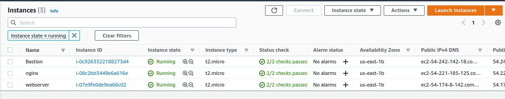

Nginx

- From EC2 Console, click Launch Templates from the left pane
- Choose the Nginx AMI
- Select the instance type (t2.micro)
- Select the key pair
- Select the security group
- Add resource tags
- Click Advanced details, scroll down to the end and configure the nginx user data script to update the yum repo and install nginx

```
#!/bin/bash
yum update -y
yum install -y nginx
systemctl start nginx
systemctl enable nginx
```

Wordpress userdata

```
#!/bin/bash
mkdir /var/www/
sudo mount -t efs -o tls,accesspoint=fsap-0cb279f5ee79c59f4 fs-0501ac1736dff39ea:/ /var/www/
yum install -y httpd
systemctl start httpd
systemctl enable httpd
yum module reset php -y
yum module enable php:remi-7.4 -y
yum install -y php php-common php-mbstring php-opcache php-intl php-xml php-gd php-curl php-mysqlnd php-fpm php-json
systemctl start php-fpm
systemctl enable php-fpm
wget http://wordpress.org/latest.tar.gz
tar xzvf latest.tar.gz
rm -rf latest.tar.gz
cp wordpress/wp-config-sample.php wordpress/wp-config.php
mkdir /var/www/html/
cp -R /wordpress/* /var/www/html/
cd /var/www/html/
touch healthstatus
sed -i "s/localhost/acs-database.cbzlhilzcstn.us-east-2.rds.amazonaws.com/g" wp-config.php
sed -i "s/username_here/ACSADMIN/g" wp-config.php
sed -i "s/password_here/password/g" wp-config.php
sed -i "s/database_name_here/wordpressdb/g" wp-config.php
chcon -t httpd_sys_rw_content_t /var/www/html/ -R
systemctl restart httpd
```

Tooling userdata

```
#!/bin/bash
mkdir /var/www/
sudo mount -t efs -o tls,accesspoint=fsap-03c7f79f1174c87e8 fs-0501ac1736dff39ea:/ /var/www/
yum install -y httpd
systemctl start httpd
systemctl enable httpd
yum module reset php -y
yum module enable php:remi-7.4 -y
yum install -y php php-common php-mbstring php-opcache php-intl php-xml php-gd php-curl php-mysqlnd php-fpm php-json
systemctl start php-fpm
systemctl enable php-fpm
git clone https://github.com/Livingstone95/tooling-1.git
mkdir /var/www/html
cp -R /tooling-1/html/*  /var/www/html/
cd /tooling-1
mysql -h acs-database.cbzlhilzcstn.us-east-2.rds.amazonaws.com -u ACSADMIN -p toolingdb < tooling-db.sql
cd /var/www/html/
touch healthstatus
sed -i "s/$db = mysqli_connect('mysql.tooling.svc.cluster.local', 'admin', 'admin', 'tooling');/$db = mysqli_connect('acs-database.cbzlhilzcstn.us-east-2.rds.amazonaws.com', 'ACSADMIN', 'password', 'toolingdb');/g" functions.php
chcon -t httpd_sys_rw_content_t /var/www/html/ -R
mv /etc/httpd/conf.d/welcome.conf /etc/httpd/conf.d/welcome.conf_backup
systemctl restart httpd
* Create Target groups for Nginx, Worpress and Tooling
* _This is because they are all behind a load balancer. The Auto-Scaling will launch instance in this target group_
```

User data for Nginx

```
#!/bin/bash
yum install -y nginx
systemctl start nginx
systemctl enable nginx
git clone https://github.com/EstherAlo/ACS-project-config.git
mv /ACS-project-config/reverse.conf /etc/nginx/
mv /etc/nginx/nginx.conf /etc/nginx/nginx.conf-distro
cd /etc/nginx/
touch nginx.conf
sed -n 'w nginx.conf' reverse.conf
systemctl restart nginx
rm -rf reverse.conf
rm -rf /ACS-project-config
```

_We have to update the reverse.conf file by updating the end point of the internal load balancer (DNS name) in the proxy_pass section of the file, so that when the userdata is cloning the repository, it will have the updated version of the conf file_

bastion userdata

```
#!/bin/bash
yum install -y mysql
yum install -y git tmux
yum install -y ansible
```

- Configure Target Groups
  - Select instances as target type
  - Enter the target group name
  - Select the VPC you created
  - For health checks, select HTTPS and health check path as /healthstatus
  - Add Tags
  - Register Nginx, wordpress and tooling instances as targets because they are all behind a load balancer. The Auto-Scaling will launch instance in this target group.

## Step 2b: Configure external Application Load Balancer (ALB) for Nginx

- _Nginx instances should only accept connections coming from the ALB and deny any connections directly to it._

  - Create an internet facing ALB
  - From the EC2 Console, click Load Balancers.
  - On the block for Application Load Balancers, click create
  - Enter the name for the load balancer
  - Since it's for the Nginx servers, add a HTTPS Listener
  - Select the VPC you created, check the two AZs and add the public subnets you have. Click next.
  - Select the certificate you created on ACM

## Step 2c: Configure internal ALB for Webservers

_The ALB for the webservers should not be internet facing. We need to create Load Balancers to be placed in the relevant private subnet_

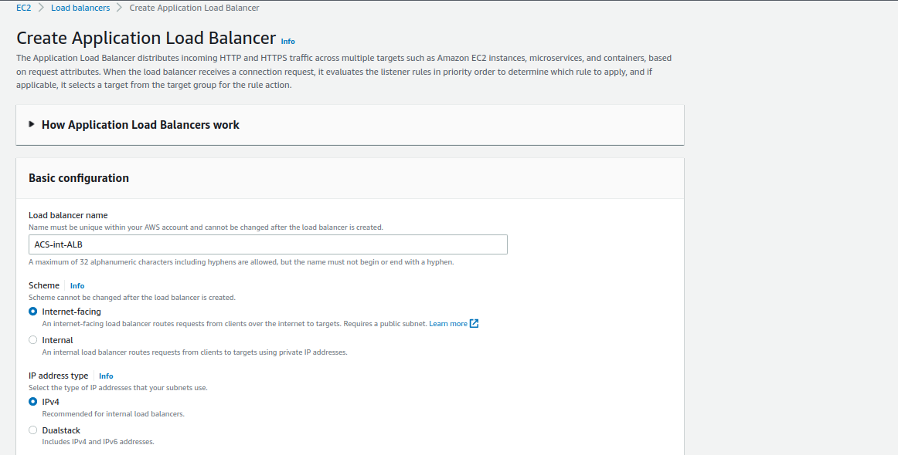
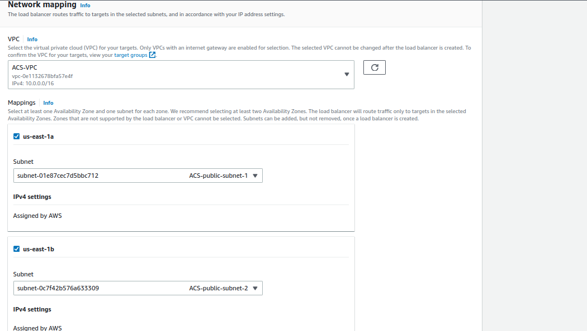
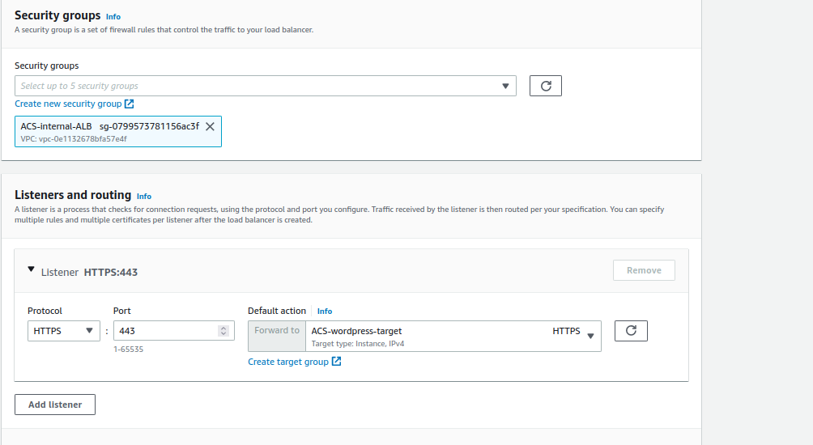

- Select internal load balancer
- click on listeners
- _from the screenshot, it could be depicted that every traffic that comes into the load balancer forwards to Wordpress target_

  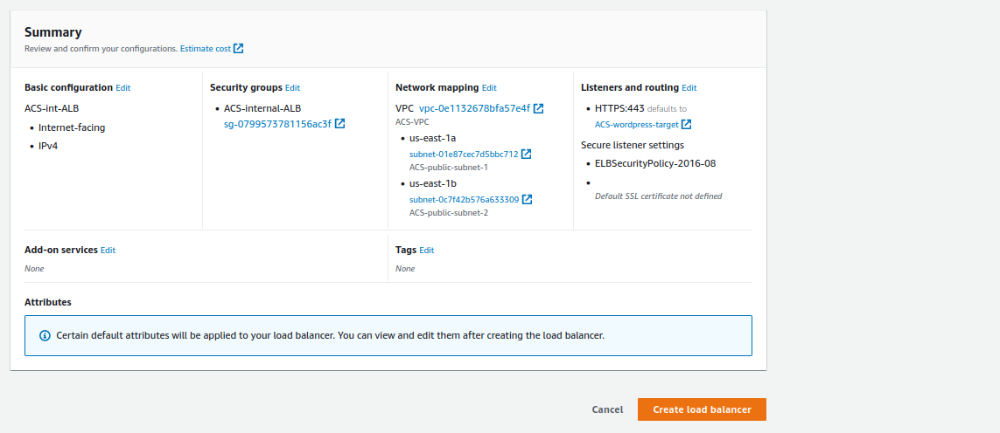

- configure a rule so that we can cache tooling request and forward to the tooling target

## Step 3: Setup EFS

- Navigate to EFS from your Management Console
- Click create file system from the right
- Click Customize
- Enter the name for the EFS
- Tag the resource
- Leave everything else and click next
- Select the VPC you created, select the two AZs and choose the private subnets
- Select the EFS security group

  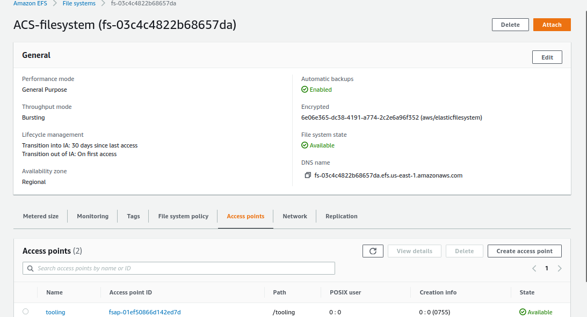

## Step 4: Setup RDS

- _before we commence on we need to create KMS key (to encrypt RDS instance) and subnet group (placed in private)_
- Navigate to AWS KMS
- Click create key
- Make sure it's symmetric
- Give the key an alias

  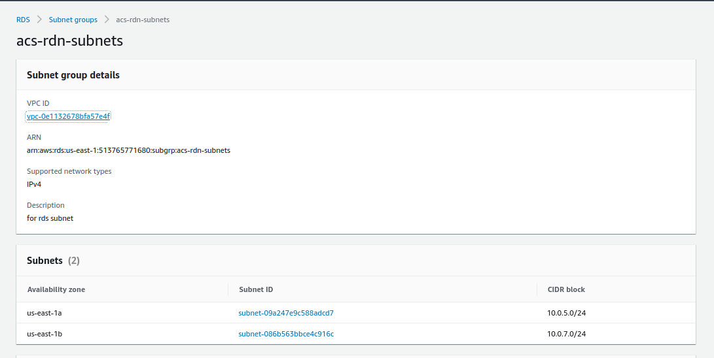

## Step 4a: Create a DB Subnet Group

- Navigate to RDS Management Console
- Select Subnet groups
- Click Create DB subnet group
- Enter the name, description and select your VPC
- Under Add subnets, select the two AZs your VPC is in and select the two private data layer subnets.

  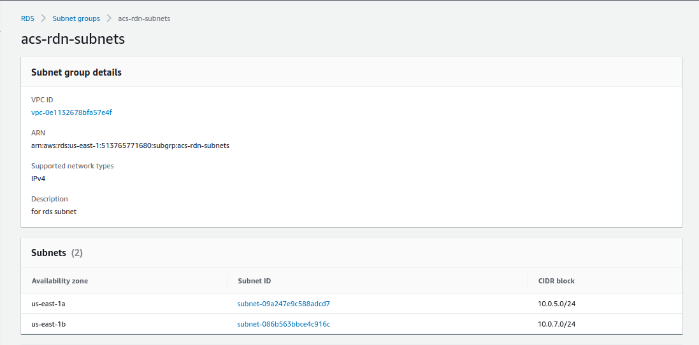

## Step 4b: Create RDS Instance

- Navigate to RDS Management Console
- Click Create database
- For Engine options, select MySQL
- For Template, choose Dev/Test
- Enter a name for your DB under DB instance identifier
- Enter Master username and passsword
- Choose the smallest possible instance class (to reduce costs)
- Under Availability, select do not create a standby instance
- Select your VPC, select the subnet group you created and also the data layer security group
- Leave everything else and scroll down to Additional configuration
- Enter initial database name (if you wish, or you could connect to it from your webserver and create required databases)
- Leave everything else, scroll down to Encryption and select the KMS key you created
- Scroll down and click Create database

  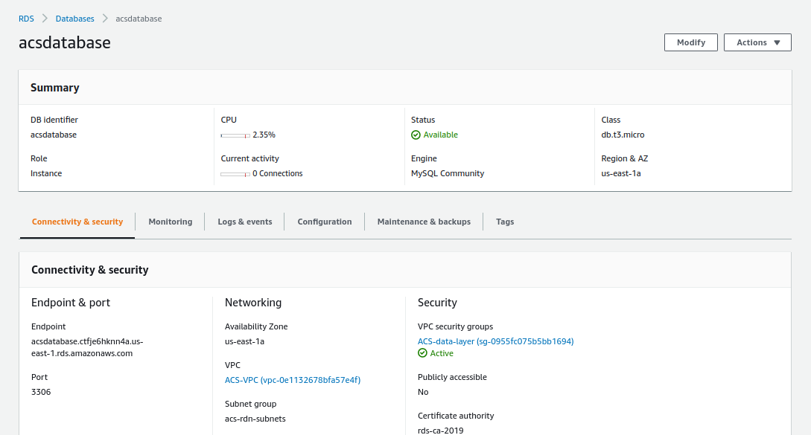

## Step 5 : Update userdata with access point & end point

- Create access point next which will specify where the webservers will mount with, thus creating 2 mount points for Tooling and Wordpress servers each.

- Update the mount point to the file system, this should be done on access points for tooling and wordpress respectively

  - Click on wordpress access point
  - Click on attach
  - Copy the command but do not include 'efs'
  - paste into wordpress userdata
  - Repeat for tooling

  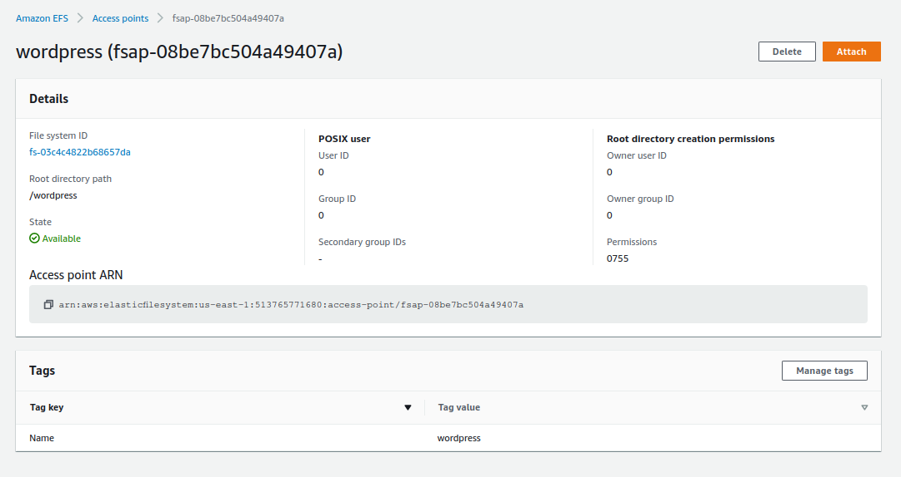

- Copy and Paste the rds end-point in the wordpress userdata and tooling userdata

  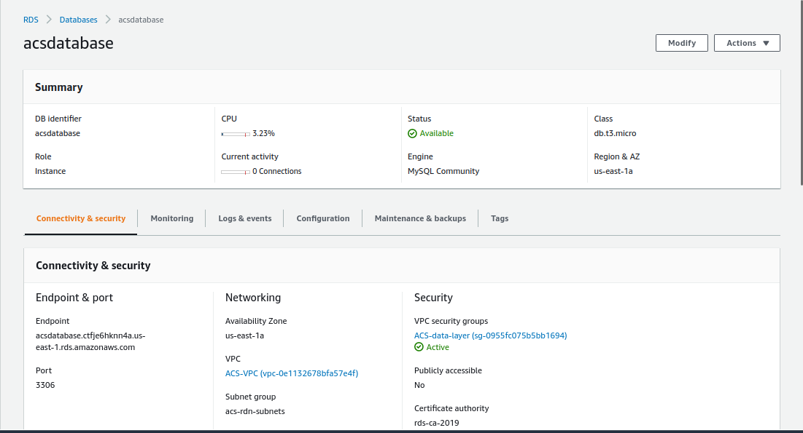

- Update the reverse.conf file with the domain name

- shh into bastion host

```
ssh -A ec2-user@<privateip>
```

- connect to RDS and create a toolingdb and wordpressdb

```
mysql -h <RDS endoint -u <RDSusername> -p
create database wordpressdb;
create wordpressdb;
show databases;
```

## Step 6 : Create Autoscaling Group

- Create Autoscaling Group for Nginx, WordPress and Tooling. The same setting used for the Bastion server will be used for Nginx, the only difference is the Load Balancer is added to Nginx, Wordpress and Tooling as the Bastion does not make use of load balancer.
  - Create autoscaling group
  - Name the autoGroup
  - Select bastion template and click next
  - Select adhere to launch template
  - select VPC
  - Select public subnet 1 and 2 and click next
  - Select the ELB health check
  - Leave the desire capacity as the default settings
  - select target tracking scaling policy and set target value as 90 and click next

## Step 7: Configure DNS with Route 53

- Check if All target group are healthy

  

- Output

  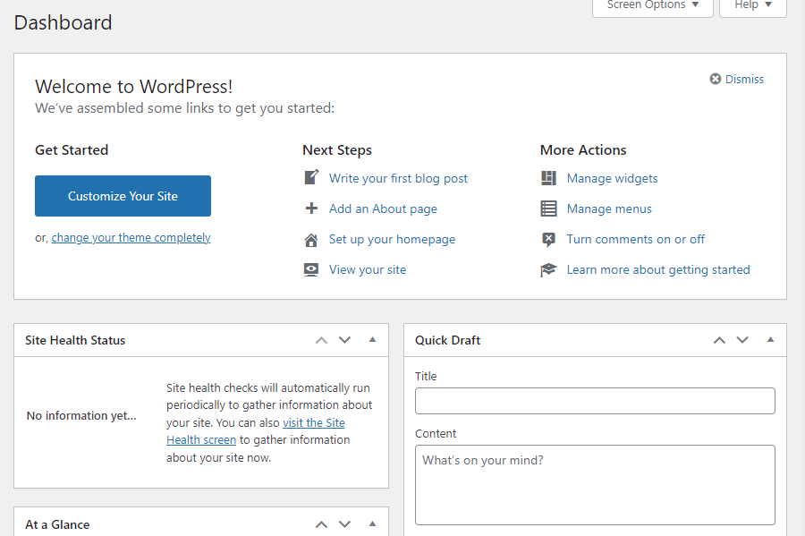

  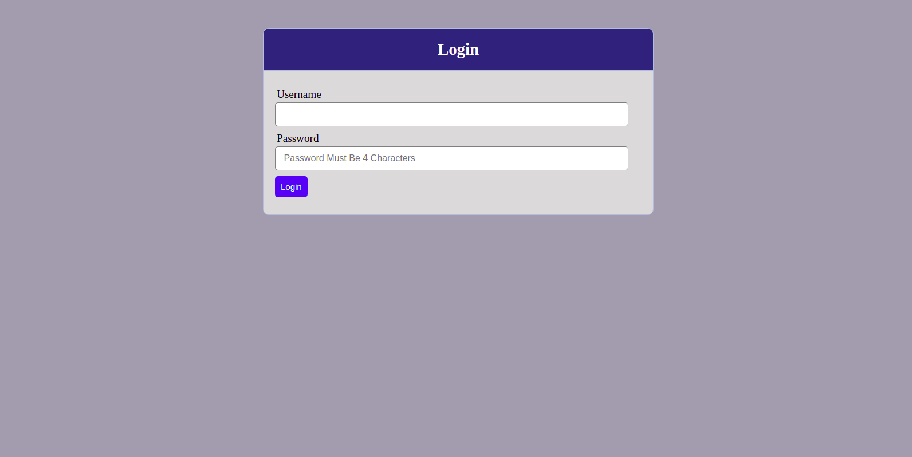
