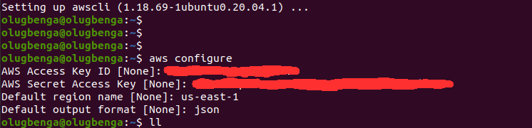
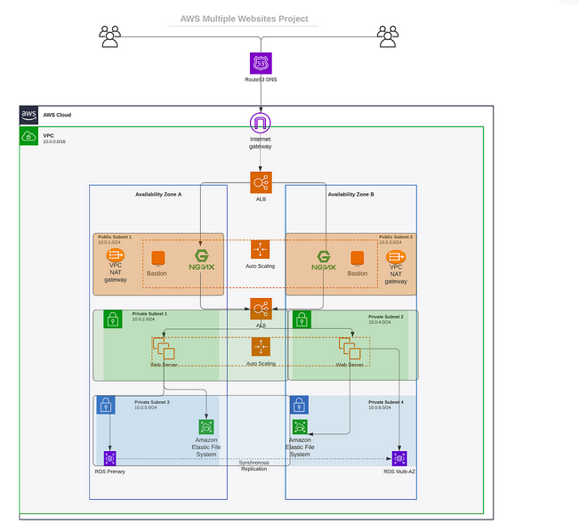
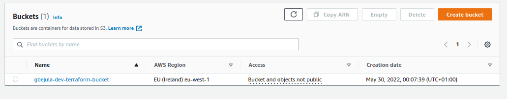
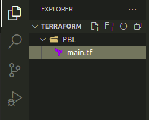
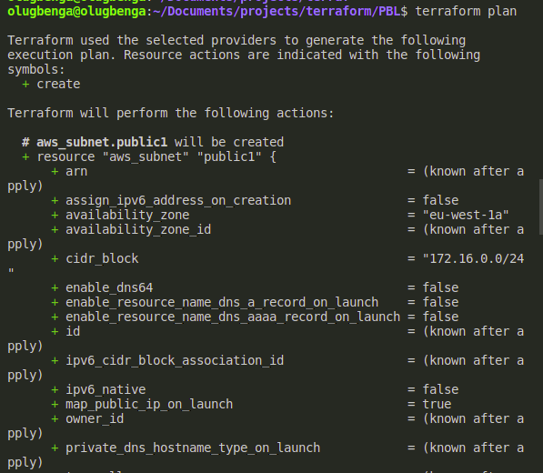
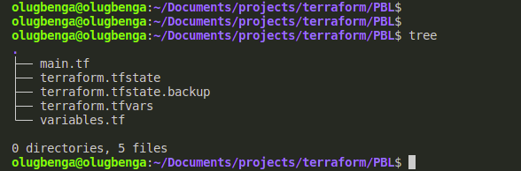
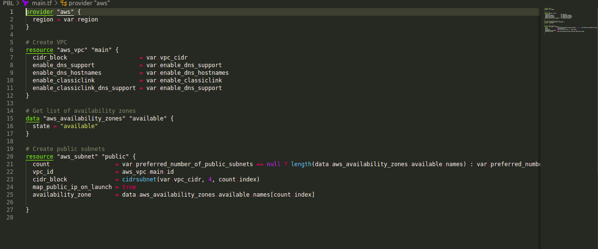
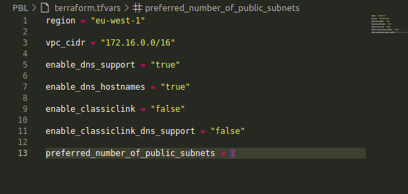

# PROJECT 16: AUTOMATE INFRASTRUCTURE WITH IAC USING TERRAFORM PART 1

- In this project we will automate the process of building AWS infrastructure for 2 websites manually using terraform.

- We will be the power of Infrastructure As Code (IaC)

- For easier authentication configuration – use AWS CLI with aws configure command.

  

  

- Create an S3 bucket to store Terraform state file. You can name it something like <yourname>-dev-terraform-bucket (Note: S3 bucket names must be unique unique within a region partition, you can read about S3 bucken naming in this article).

- Bucket created

  

- Open your Visual Studio Code and:

- Create a folder called PBL
- Create a file in the folder, name it main.tf

  

- Set up Terraform CLI

- Add AWS as a provider, and a resource to create a VPC in the main.tf file.
- Provider block informs Terraform that we intend to build infrastructure within AWS.
- Resource block will create a VPC.

```
provider "aws" {
  region = "eu-central-1"
}

# Create VPC
resource "aws_vpc" "main" {
  cidr_block                     = "172.16.0.0/16"
  enable_dns_support             = "true"
  enable_dns_hostnames           = "true"
  enable_classiclink             = "false"
  enable_classiclink_dns_support = "false"
}
```

- Change the region to that showing in the bucket - i.e. eu-west-1

- Run terraform plan

  

- Create a variable for the region

```
variable "region" {
        default = "eu-central-1"
    }

    provider "aws" {
        region = var.region
    }
```

- Allow the public subnets to create automatically

```
# Create public subnets
resource "aws_subnet" "public" {
  count  = var.preferred_number_of_public_subnets == null ? length(data.aws_availability_zones.available.names) : var.preferred_number_of_public_subnets
  vpc_id = aws_vpc.main.id
  cidr_block              = cidrsubnet(var.vpc_cidr, 4 , count.index)
  map_public_ip_on_launch = true
  availability_zone       = data.aws_availability_zones.available.names[count.index]

}
```

The main.tf file now looks

```
# Get list of availability zones
data "aws_availability_zones" "available" {
state = "available"
}

variable "region" {
      default = "eu-central-1"
}

variable "vpc_cidr" {
    default = "172.16.0.0/16"
}

variable "enable_dns_support" {
    default = "true"
}

variable "enable_dns_hostnames" {
    default ="true"
}

variable "enable_classiclink" {
    default = "false"
}

variable "enable_classiclink_dns_support" {
    default = "false"
}

  variable "preferred_number_of_public_subnets" {
      default = 2
}

provider "aws" {
  region = var.region
}

# Create VPC
resource "aws_vpc" "main" {
  cidr_block                     = var.vpc_cidr
  enable_dns_support             = var.enable_dns_support
  enable_dns_hostnames           = var.enable_dns_support
  enable_classiclink             = var.enable_classiclink
  enable_classiclink_dns_support = var.enable_classiclink

}

# Create public subnets
resource "aws_subnet" "public" {
  count  = var.preferred_number_of_public_subnets == null ? length(data.aws_availability_zones.available.names) : var.preferred_number_of_public_subnets
  vpc_id = aws_vpc.main.id
  cidr_block              = cidrsubnet(var.vpc_cidr, 4 , count.index)
  map_public_ip_on_launch = true
  availability_zone       = data.aws_availability_zones.available.names[count.index]

}
```

- Use the tree command to check the directory if all files are well aligned.

  

- Split the code for better readability to variables.tf, terraform.tfvars and main.tf

  

  

  
