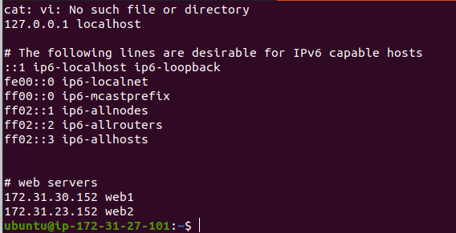
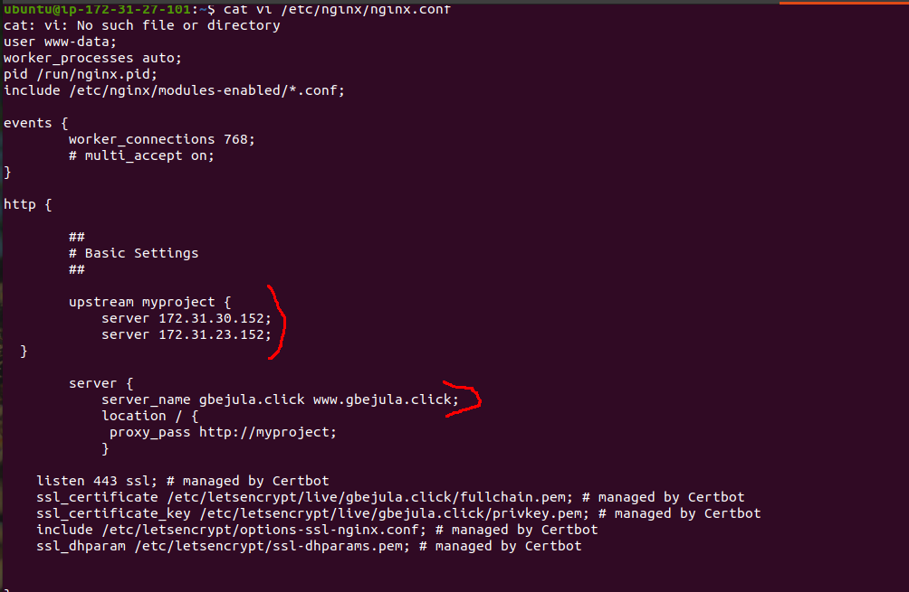
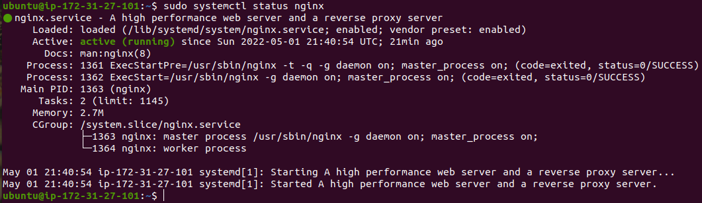
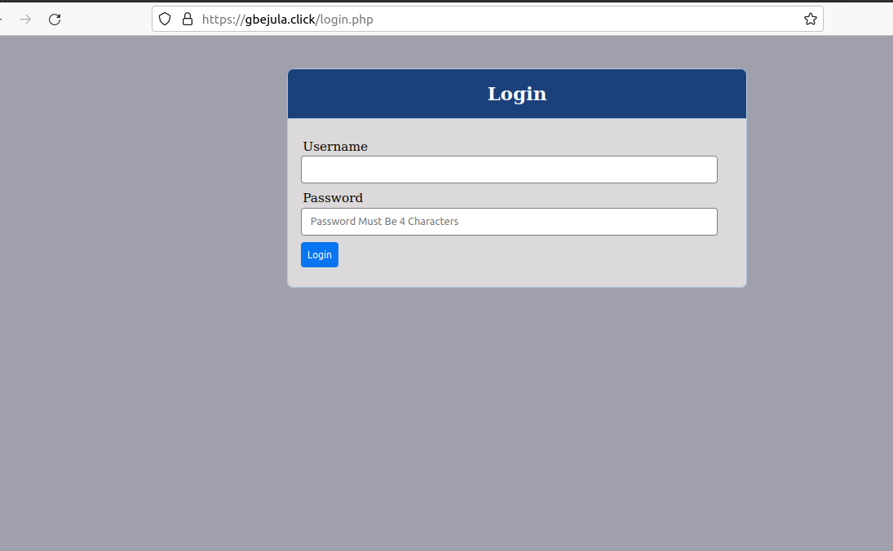
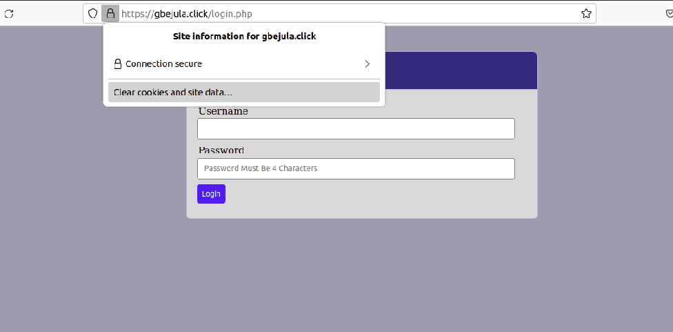

# PROJECT 10: LOAD BALANCR SOLUTION WITH NGINX AND SSL/TLS

> TASK

- This project consist of two parts:

  - Configure Nginx as a Load Balancer
  - Register a domain name and configure secured connection and using SSL/TLS

  

> ## STEP 1: CONFIGURE NGINX AS A LOAD BALANCER

- Create an EC VM based on Ubuntu Server 20.04 LTS, and name it Nginx LB

  _Ensure to open TCP port 80 for HTTP connection and TCP port 443 for the HTTPS connections._

- Update /etc/hosts file for local DNS with Web Servers’ names (e.g. Web1 and Web2) and their local IP addresses

  

- Update the instance and install nginx

  ```
  sudo apt update
  sudo apt install nginx
  ```

- Edit the nginx configuration file with private ip address of web servers and domain name

  

- Restart Nginx and make sure the service is up and running

  ```
  sudo systemctl restart nginx
  sudo systemctl status nginx
  ```

  

  Register a new domain - _I registered a domain with Route 53 on AWS._

  Click create hosted zone:

  _In the domain name, add the domain you register above_

  _Select public_

  _Create_

  _If you register your domain outside AWS, ensure to create the DNS records the for connectivity_

- Make sure snapd service is active and running

  `sudo systemctl status snapd`

- Install certbot

  `sudo systemctl status snapd`

- Request certificate

  ```
  sudo ln -s /snap/bin/certbot /usr/bin/certbot
  sudo certbot --nginx
  ```

- Link load balancer config file with the site enabled

  ```
  sudo ln -s ../sites-available/load_balancer.conf .
  ls
  ll
  sudo systemctl reload nginx
  ```

- Lunch the domain on the browser and it redirect to web server: www.gbejula.click

  

- Set SSL/TLS

  `sudo certbot renew --dry-run`

  

- Best practice: edit the crontab file with the following command:

`crontab -e`

- Add the following:

  `* */12 * * * root /usr/bin/certbot renew > /dev/null 2>&1`
