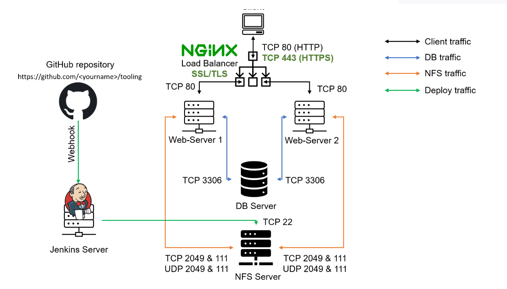

# PROJECT 10: LOAD BALANCR SOLUTION WITH NGINX AND SSL/TLS

> TASK

- This project consist of two parts:

  - Configure Nginx as a Load Balancer
  - Register a domain name and configure secured connection and using SSL/TLS

  

> ## STEP 1: CONFIGURE NGINX AS A LOAD BALANCER
