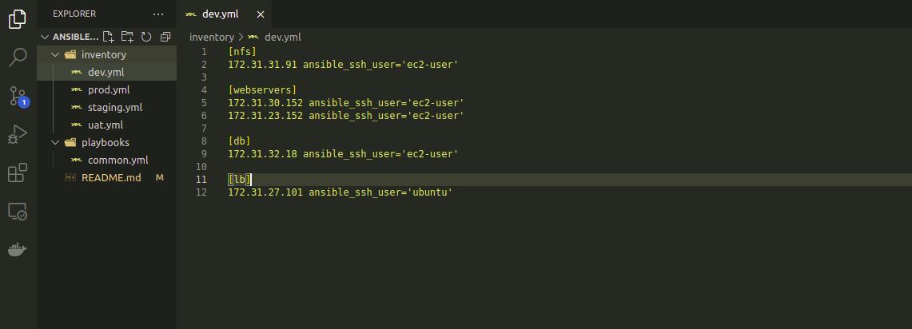

# PROJECT 11: ANSIBLE CONFIGURATION MANAGEMENT- AUTOMATE PROJECT 7 TO 10

- This Project will make you appreciate DevOps tools even more by making most of the routine tasks automated with Ansible Configuration Management, at the same time you will become confident at writing code using declarative language such as YAML. The

  

> ## INSTALL AND CONFIGURE ANSIBLE ON EC2 INSTANCE

- Update the name tag on the Jenkins EC2 instance to Jenkins ansible

- In your GitHub account create a new repository and name it ansible-config-mgt.

  

- Install Ansible - this will be done on an Ubuntu 20.04 instance

  ```
  sudo apt update
  sudo apt install ansible
  ```

- Check the version of the ansible by running:

  `ansible --version`

  

- Configure Jenkins build job to save the repository content every time a change is done – this will solidify the Jenkins configuration skills acquired in Project 9.

  - In the new repo, click the settings tab
  - Select Webhooks
  - Click 'Add Webhooks'
  - In the payload URL, add the Jenkins URL: http://x.x.x.x:8080/github-webhook
  - In the content type, select 'application-json'
  - Click 'Add'

  ![webhook image with ip]

- Configure the freestyle Jenkins build job with name - jenkins-in-ansible

  _Go to Source code management of the jenkin-in-ansible_

  _Select Git_

  _copy the new repo url 'https' and paste in the repository URL_

  

  _Under Post-build Actions, select 'Archive the artifacts'_

  _In the file to archive type, enter "\*\*"_

  

  _Click Save_

- Go back to the Jenkins-in-Ansible project and click on 'Build now"

  _The build failed_

  _I discovered that the needed to change the branch to *main* instead of *master* since it has been changed by github_

  _The build was now successfully after the change_

  

- For the automatic build, changed the README.md file

- The build did not automatic trigger. I changed the files in the README.md four times but it still did not automatically trigger.

- Looked and discovered that the "GitHub hook trigger for GITScm polling" was not checked. Then, I checked the option.

- The changed the README.md file again, and the auto build was triggered.

  

- Changes in github and checking through the console is the same

  

- Checking the changes in the Jenkins build artifacts using:

  ```
  cd /var/lib/jenkins/jobs/<new of build>/builds/<build_number>/archive/
  cd /var/lib/jenkins/jobs/ansible-in-jenkins/builds/6/archive/
  cat README.md
  ```

  

> ## PREPARE YOUR DEVELOPMENT ENVIRONMENT USING VISUAL STUDION CODE

- Download and install VS code

- Install Remote development extension

- Clone the ansible-config-mgt repo

> ## BEGIN ANSIBLE DEVELOPMENT

- In the ansible-config-mgt GitHub repository, create a new branch that will be used for development of a new feature.

- Checkout the newly created feature branch to your local machine and start building your code and directory structure

- Create a directory and name it playbooks – it will be used to store all your playbook files.

- Create a directory and name it inventory – it will be used to keep your hosts organised.

- Within the playbooks folder, create your first playbook, and name it common.yml

- Within the inventory folder, create an inventory file (.yml) for each environment (Development, Staging Testing and Production) dev, staging, uat, and prod respectively.

> ## SET UP AN ANSIBLE INVENTORY

- An Ansible inventory file defines the hosts and groups of hosts upon which commands, modules, and tasks in a playbook operate. Since our intention is to execute Linux commands on remote hosts, and ensure that it is the intended configuration on a particular server that occurs. It is important to have a way to organize our hosts in such an Inventory.

- Save below inventory structure in the inventory/dev file to start configuring your development servers. Ensure to replace the IP addresses according to your own setup.

```
eval `ssh-agent -s`
ssh-add <path-to-private-key>
```

- Confirm the key has been added with the command below, you should see the name of your key. This should be done from the command line

  `ssh-add -l`

- Now, ssh into your Jenkins-Ansible server using ssh-agent.

  `ssh -A ubuntu@public-ip`

  

- Update the inventory/dev.yml file with this snippet of code:

  ```
  [nfs]
  <NFS-Server-Private-IP-Address> ansible_ssh_user='ec2-user'

  [webservers]
  <Web-Server1-Private-IP-Address> ansible_ssh_user='ec2-user'
  <Web-Server2-Private-IP-Address> ansible_ssh_user='ec2-user'

  [db]
  <Database-Private-IP-Address> ansible_ssh_user='ec2-user'

  [lb]
  <Load-Balancer-Private-IP-Address> ansible_ssh_user='ubuntu'
  ```

  

  

> ## CREATE A COMMON PLAYBOOK

-
