# PROJECT 12: ANSIBLE REFACTORING AND STATIC ASSIGNMENTS (IMPORTS AND ROLES)

- Refactoring is a general term in computer programming. It means making changes to the source code without changing expected behaviour of the software. The main idea of refactoring is to enhance code readability, increase maintainability and extensibility, reduce complexity, add proper comments without affecting the logic.

> ## STEP 1 - JENKINS JOB ENHANCEMENT

- Go to the Jenkins-Ansible server and create a new directory called ansible-config-artifact – we will store there all artifacts after each build.

  `sudo mkdir /home/ubuntu/ansible-config-artifact`

  

- Change permissions to this directory, so Jenkins could save files there –

  `chmod -R 0777 /home/ubuntu/ansible-config-artifact`

- Go to Jenkins web console -> Manage Jenkins -> Manage Plugins -> on Available tab search for Copy Artifact and install this plugin without restarting Jenkins

  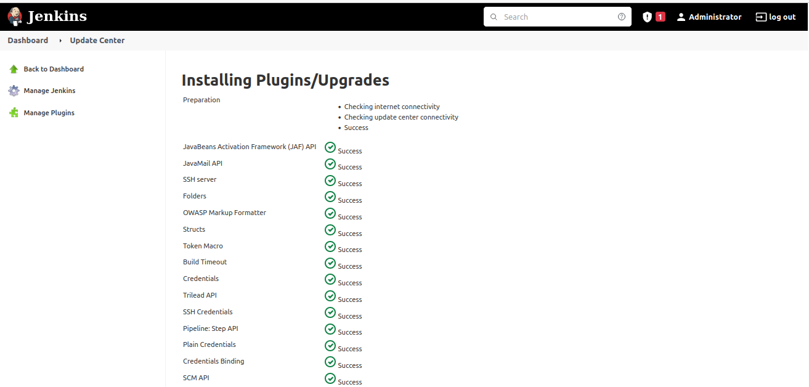

  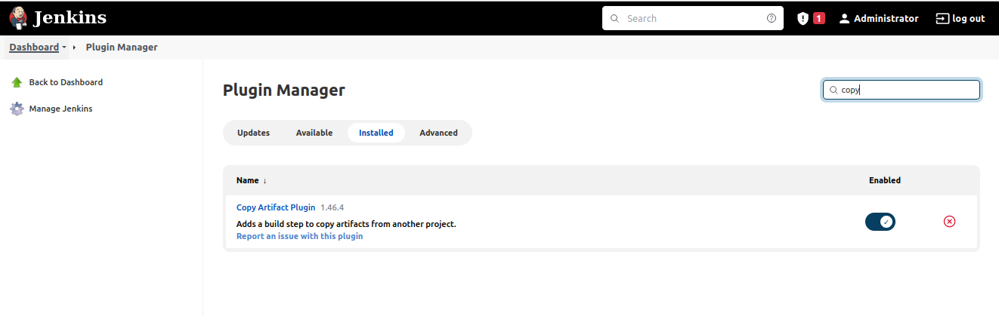

- A new freestyle project created called **save_artifacts**

- The project will be triggered by completion of your existing ansible project. Configure it accordingly

  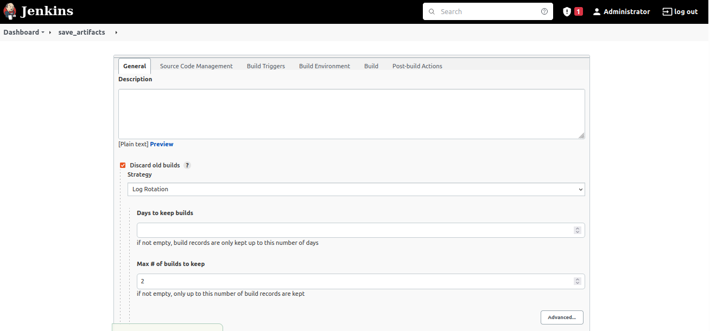

  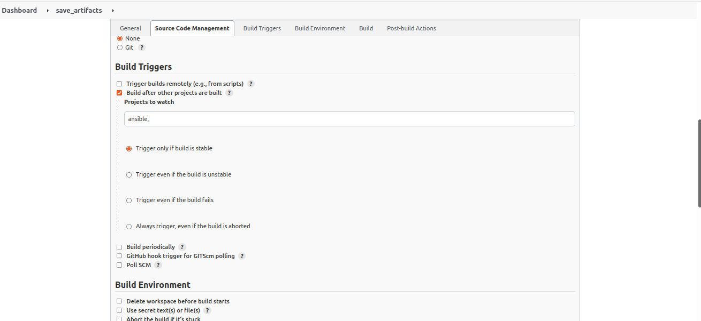

- The main idea of save_artifacts project is to save artifacts into /home/ubuntu/ansible-config-artifact directory. To achieve this, create a Build step and choose Copy artifacts from other project, specify ansible as a source project and /home/ubuntu/ansible-config-artifact as a target directory.

  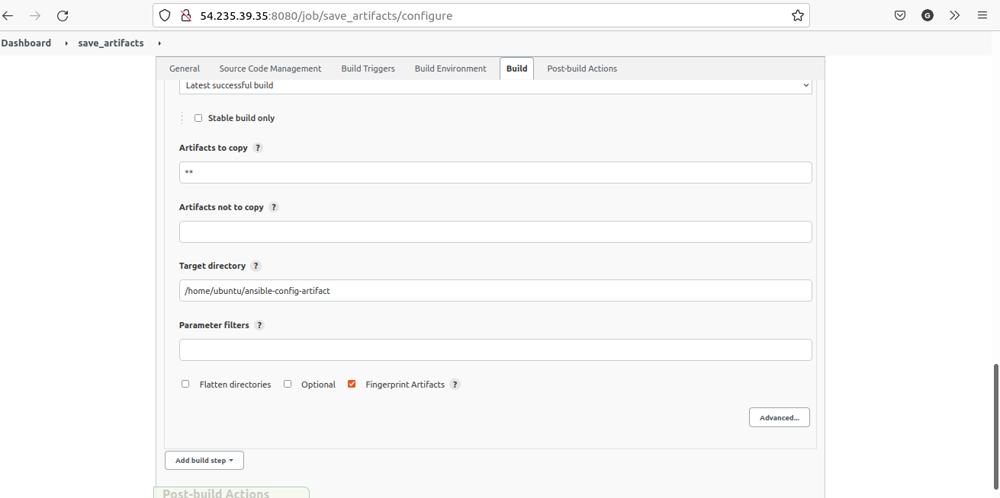

- Test the set up by making some change in README.MD file inside your ansible-config-mgt repository (right inside master branch).

  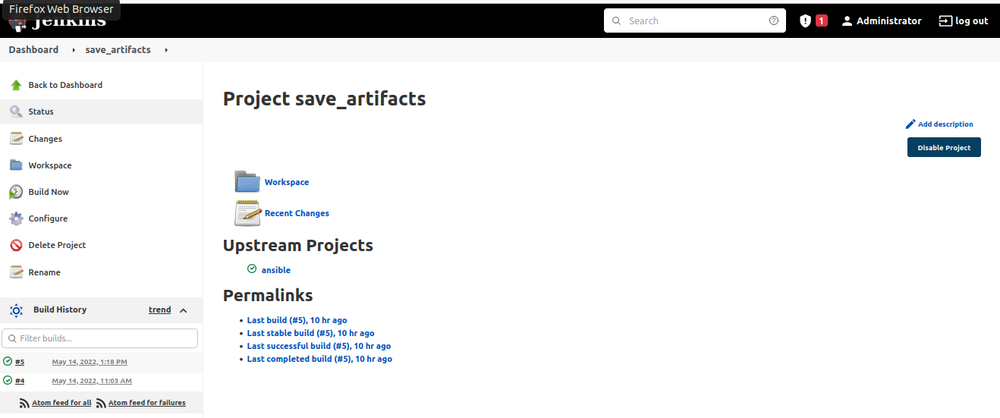

> ## STEP2: REFACTOR ANSIBLE CODE BY IMPORTING OTHER PLAYBOOKS INTO SITE.YML

- Before starting to refactor the codes, ensure that you have pulled down the latest code from master (main) branch, and created a new branch, name it **refactor**.

  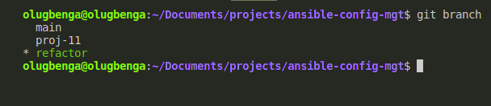

- Within playbooks folder, create a new file and name it **site.yml** – This file will now be considered as an entry point into the entire infrastructure configuration. Other playbooks will be included here as a reference.

- Create a new folder in root of the repository and name it **static-assignments**. The static-assignments folder is where all other children playbooks will be stored.

- Move **common.yml** file into the newly created static-assignments folder.

  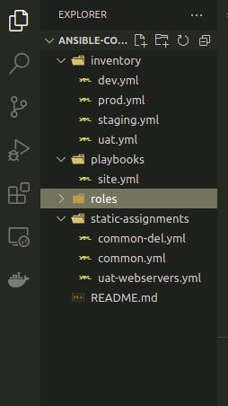

- Inside site.yml file, import common.yml playbook.

  ```
  ---
  - hosts: all
  - import_playbook: ../static-assignments/common.yml
  ```

- Since the need to apply some tasks to the dev servers and wireshark is already installed – Create another playbook under static-assignments and name it **common-del.yml**. In this playbook, configure deletion of wireshark utility.

```
---
- name: update web, nfs and db servers
  hosts: webservers, nfs, db
  remote_user: ec2-user
  become: yes
  become_user: root
  tasks:
  - name: delete wireshark
    yum:
      name: wireshark
      state: removed

- name: update LB server
  hosts: lb
  remote_user: ubuntu
  become: yes
  become_user: root
  tasks:
  - name: delete wireshark
    apt:
      name: wireshark-qt
      state: absent
      autoremove: yes
      purge: yes
      autoclean: yes
```

- Update site.yml with - import_playbook: ../static-assignments/common-del.yml instead of common.yml and run it against dev servers:

  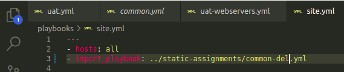

  ```
  cd /home/ubuntu/ansible-config-mgt/
  ansible-playbook -i inventory/dev.yml playbooks/site.yml
  ```

- Make sure that wireshark is deleted on all the servers by running wireshark --version

  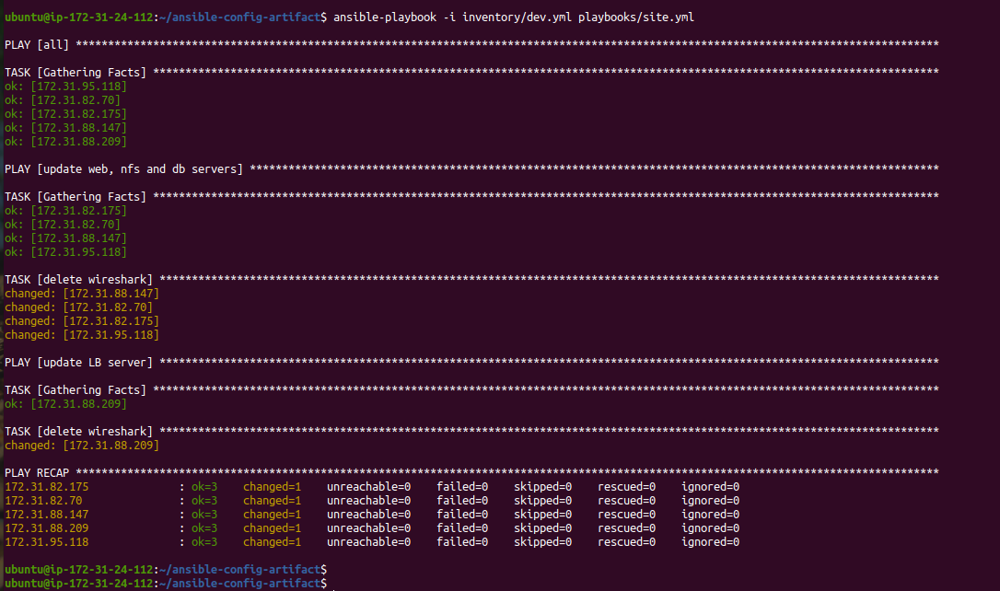

  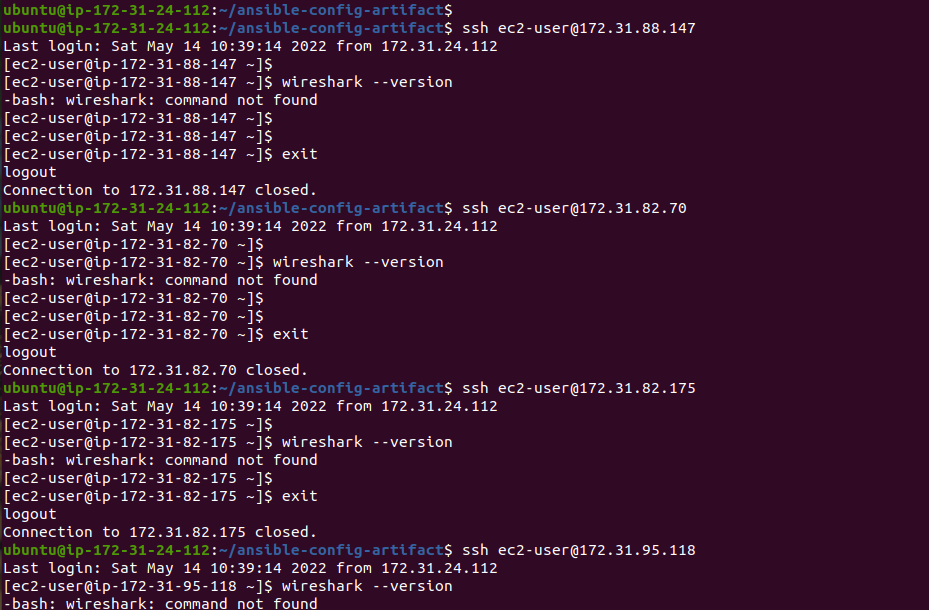
