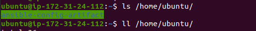
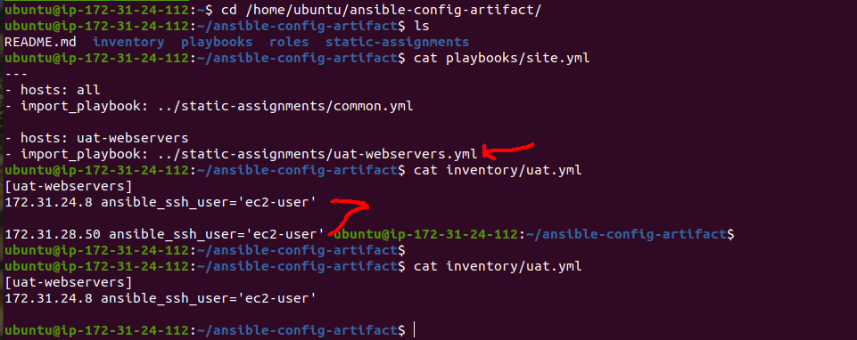

# PROJECT 12: ANSIBLE REFACTORING AND STATIC ASSIGNMENTS (IMPORTS AND ROLES)

- Refactoring is a general term in computer programming. It means making changes to the source code without changing expected behaviour of the software. The main idea of refactoring is to enhance code readability, increase maintainability and extensibility, reduce complexity, add proper comments without affecting the logic.

> ## STEP 1 - JENKINS JOB ENHANCEMENT

- Go to the Jenkins-Ansible server and create a new directory called ansible-config-artifact – we will store there all artifacts after each build.

  `sudo mkdir /home/ubuntu/ansible-config-artifact`

  

- Change permissions to this directory, so Jenkins could save files there –

  `chmod -R 0777 /home/ubuntu/ansible-config-artifact`

- Go to Jenkins web console -> Manage Jenkins -> Manage Plugins -> on Available tab search for Copy Artifact and install this plugin without restarting Jenkins

  

  

- A new freestyle project created called **save_artifacts**

- The project will be triggered by completion of your existing ansible project. Configure it accordingly

  

  

- The main idea of save_artifacts project is to save artifacts into /home/ubuntu/ansible-config-artifact directory. To achieve this, create a Build step and choose Copy artifacts from other project, specify ansible as a source project and /home/ubuntu/ansible-config-artifact as a target directory.

  

- Test the set up by making some change in README.MD file inside your ansible-config-mgt repository (right inside master branch).

  

> ## STEP2: REFACTOR ANSIBLE CODE BY IMPORTING OTHER PLAYBOOKS INTO SITE.YML

- Before starting to refactor the codes, ensure that you have pulled down the latest code from master (main) branch, and created a new branch, name it **refactor**.

  

- Within playbooks folder, create a new file and name it **site.yml** – This file will now be considered as an entry point into the entire infrastructure configuration. Other playbooks will be included here as a reference.

- Create a new folder in root of the repository and name it **static-assignments**. The static-assignments folder is where all other children playbooks will be stored.

- Move **common.yml** file into the newly created static-assignments folder.

  

- Inside site.yml file, import common.yml playbook.

  ```
  ---
  - hosts: all
  - import_playbook: ../static-assignments/common.yml
  ```

- Since the need to apply some tasks to the dev servers and wireshark is already installed – Create another playbook under static-assignments and name it **common-del.yml**. In this playbook, configure deletion of wireshark utility.

```
---
- name: update web, nfs and db servers
  hosts: webservers, nfs, db
  remote_user: ec2-user
  become: yes
  become_user: root
  tasks:
  - name: delete wireshark
    yum:
      name: wireshark
      state: removed

- name: update LB server
  hosts: lb
  remote_user: ubuntu
  become: yes
  become_user: root
  tasks:
  - name: delete wireshark
    apt:
      name: wireshark-qt
      state: absent
      autoremove: yes
      purge: yes
      autoclean: yes
```

- Update site.yml with - import_playbook: ../static-assignments/common-del.yml instead of common.yml and run it against dev servers:

  

  ```
  cd /home/ubuntu/ansible-config-mgt/
  ansible-playbook -i inventory/dev.yml playbooks/site.yml
  ```

- Make sure that wireshark is deleted on all the servers by running wireshark --version

  

  

> ## STEP 3: CONFIGURE UAT WEBSERVERS WITH A ROLE 'WEBSERVER'

- Launch 2 fresh EC2 instances using RHEL 8 image, we will use them as our uat servers, so give them names accordingly – Web1-UAT and Web2-UAT.

- We could write tasks to configure Web Servers in the same playbook, but it would be too messy, instead, we will use a dedicated role to make our configuration reusable.

  

- To create a role, you must create a directory called roles/, relative to the playbook file or in /etc/ansible/ directory.

- There are two ways how you can create this folder structure:

  - Use an Ansible utility called ansible-galaxy inside ansible-config-mgt/roles directory (you need to create roles directory upfront)

  ```
  mkdir roles
  cd roles
  ansible-galaxy init webserver
  ```

  - Create the directory/files structure manually

  - Note: Choose either way, but since it store all your codes in GitHub, it is recommended to create folders and files there rather than locally on Jenkins-Ansible server.

- After removing unnecessary directories and files, the roles structure should look like this

  

- Update the inventory ansible-config-mgt/inventory/uat.yml file with IP addresses of your 2 UAT Web servers

  

- In /etc/ansible/ansible.cfg file uncomment **roles_path** string and provide a full path to your roles directory roles_path = **/home/ubuntu/ansible-config-artifact/roles**, so Ansible could know where to find configured roles.

  

- It is time to start adding some logic to the webserver role. Go into tasks directory, and within the main.yml file, start writing configuration tasks to do the following:

  ```
  Install and configure Apache (httpd service)
  Clone Tooling website from GitHub https://github.com/<your-name>/tooling.git.
  Ensure the tooling website code is deployed to /var/www/html on each of 2 UAT Web servers.
  Make sure httpd service is started
  ```

- Hence, the **main.yml** file will consist of the following:

```
---
- name: install apache
  become: true
  ansible.builtin.yum:
    name: "httpd"
    state: present

- name: install git
  become: true
  ansible.builtin.yum:
    name: "git"
    state: present

- name: clone a repo
  become: true
  ansible.builtin.git:
    repo: https://github.com/<your-name>/tooling.git
    dest: /var/www/html
    force: yes

- name: copy html content to one level up
  become: true
  command: cp -r /var/www/html/html/ /var/www/

- name: Start service httpd, if not started
  become: true
  ansible.builtin.service:
    name: httpd
    state: started

- name: recursively remove /var/www/html/html/ directory
  become: true
  ansible.builtin.file:
    path: /var/www/html/html
    state: absent
```

> ## STEP 4: REFERENCE 'WEBSERVER' ROLE

- Within the **static-assignments** folder, create a new assignment file **uat-webservers.yml**. This is where you will reference the role.

  

- Remember that the entry point to our ansible configuration is the site.yml file. Therefore, we need to refer the uat-webservers.yml role inside site.yml.

- Hence, the site.yml file looks like:

  

> ## STEP 5: COMMIT & TEST

- Commit your changes, create a Pull Request and merge them to master branch, make sure webhook triggered two consequent Jenkins jobs, they ran successfully and copied all the files to your Jenkins-Ansible server into /home/ubuntu/ansible-config-mgt/ directory.

  

  

  

  

- Now run the playbook against your uat inventory and see what happens:

  `sudo ansible-playbook -i /home/ubuntu/ansible-config-artifact/inventory/uat.yml /home/ubuntu/ansible-config-artifact/playbooks/site.yaml`

- You should be able to see both of your UAT Web servers configured and you can try to reach them from your browser:

  ```
  http://<Web1-UAT-Server-Public-IP-or-Public-DNS-Name>/index.php
  or
  http://<Web1-UAT-Server-Public-IP-or-Public-DNS-Name>/index.php
  ```

  **_Web1 Output_**

  

  **_Web2 Output_**

  
