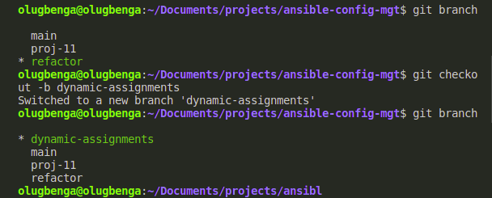

# PROJECT 13: ANSIBLE DYNAMIC ASSIGNMENTS (INCLUDE) AND COMMUNITY ROLES.

> ## STEP 1 - INTRODUCING DYNAMIC ASSIGNMENT INTO OUR STRUCTURE

- In your https://github.com/gbejula/ansible-config-mgt GitHub repository start a new branch and call it dynamic-assignments.

  

- Create a new folder, name it dynamic-assignments. Then inside this folder, create a new file and name it env-vars.yml.

  

> ## STEP 2 - UPDATE SITE.YML WITH DYNAMIC ASSIGNMENTS

- Update site.yml file to make use of the dynamic assignment. site.yml should now look like this.

```
---
- hosts: all
- name: Include dynamic variables
  tasks:
  import_playbook: ../static-assignments/common.yml
  include: ../dynamic-assignments/env-vars.yml
  tags:
    - always

-  hosts: webservers
- name: Webserver assignment
  import_playbook: ../static-assignments/webservers.yml
```

- Download Mysql Ansible Role

  _You can browse available community roles [here](https://galaxy.ansible.com/home)_

  _We will be using a [MySQL role developed by geerlingguy](https://galaxy.ansible.com/geerlinggy/mysql)._

- Hint: To preserve your your GitHub in actual state after you install a new role – make a commit and push to master your ‘ansible-config-mgt’ directory. Of course you must have git installed and configured on Jenkins-Ansible server and, for more convenient work with codes, you can configure Visual Studio Code to work with this directory. In this case, you will no longer need webhook and Jenkins jobs to update your codes on Jenkins-Ansible server, so you can disable it – we will be using Jenkins later for a better purpose.

- On Jenkins-Ansible server make sure that git is installed with git --version, then go to ‘ansible-config-mgt’ directory and run

  ```
  git init
  git pull https://github.com/<your-name>/ansible-config-mgt.git
  git remote add origin https://github.com/<your-name>/ansible-config-mgt.git
  git branch roles-feature
  git switch roles-feature
  ```

- Inside roles directory create your new MySQL role with ansible-galaxy install geerlingguy.mysql and rename the folder to mysql

  `mv geerlingguy.mysql/ mysql` - use **sudo** if permission is denied

- Read README.md file, and edit roles configuration to use correct credentials for MySQL required for the tooling website.
  Now it is time to upload the changes into your GitHub:

  ```
  git add .
  git commit -m "Commit new role files into GitHub"
  git push --set-upstream origin roles-feature
  ```
