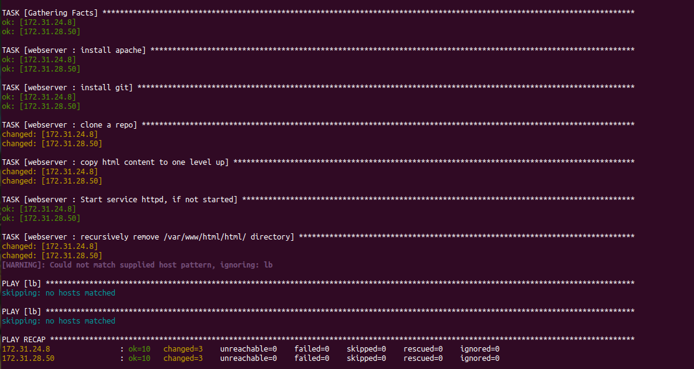

# PROJECT 13: ANSIBLE DYNAMIC ASSIGNMENTS (INCLUDE) AND COMMUNITY ROLES.

> ## STEP 1 - INTRODUCING DYNAMIC ASSIGNMENT INTO OUR STRUCTURE

- In your https://github.com/gbejula/ansible-config-mgt GitHub repository start a new branch and call it dynamic-assignments.

  

- Create a new folder, name it dynamic-assignments. Then inside this folder, create a new file and name it env-vars.yml.

  

> ## STEP 2 - UPDATE SITE.YML WITH DYNAMIC ASSIGNMENTS

- Update site.yml file to make use of the dynamic assignment. site.yml should now look like this.

```
---
- hosts: all
- name: Include dynamic variables
  tasks:
  import_playbook: ../static-assignments/common.yml
  include: ../dynamic-assignments/env-vars.yml
  tags:
    - always

-  hosts: webservers
- name: Webserver assignment
  import_playbook: ../static-assignments/webservers.yml
```

- Download Mysql Ansible Role

  _You can browse available community roles [here](https://galaxy.ansible.com/home)_

  _We will be using a [MySQL role developed by geerlingguy](https://galaxy.ansible.com/geerlinggy/mysql)._

- Hint: To preserve your your GitHub in actual state after you install a new role – make a commit and push to master your ‘ansible-config-mgt’ directory. Of course you must have git installed and configured on Jenkins-Ansible server and, for more convenient work with codes, you can configure Visual Studio Code to work with this directory. In this case, you will no longer need webhook and Jenkins jobs to update your codes on Jenkins-Ansible server, so you can disable it – we will be using Jenkins later for a better purpose.

- On Jenkins-Ansible server make sure that git is installed with git --version, then go to ‘ansible-config-mgt’ directory and run

  ```
  git init
  git pull https://github.com/<your-name>/ansible-config-mgt.git
  git remote add origin https://github.com/<your-name>/ansible-config-mgt.git
  git branch roles-feature
  git switch roles-feature
  ```

  

- Inside roles directory create your new MySQL role with ansible-galaxy install geerlingguy.mysql and rename the folder to mysql

  `mv geerlingguy.mysql/ mysql` - use **sudo** if permission is denied

  

  

- Read README.md file, and edit roles configuration to use correct credentials for MySQL required for the tooling website.
  Now it is time to upload the changes into your GitHub:

  ```
  git add .
  git commit -m "Commit new role files into GitHub"
  git push --set-upstream origin roles-feature
  ```

  

- ### Git push failed because the remote for the git was in **https**, so I had to change git remote origin to **git**

  

- Changed the remote origin git, then git push was successful.

  

- Carry out git pull request and merge it to the main branch.

> ## STEP 3: LOAD BALANCER ROLES

- We want to be able to choose which Load Balancer to use, Nginx or Apache, so we need to have two roles respectively:

  - Nginx
  - Apache

- With your experience on Ansible so far you can:

  - Decide if you want to develop your own roles, or find available ones from the community
  - Update both static-assignment and site.yml files to refer the roles

    

- Important Hints:

  - Since you cannot use both Nginx and Apache load balancer, you need to add a condition to enable either one – this is where you can make use of variables.

  - Declare a variable in defaults/main.yml file inside the Nginx and Apache roles. Name each variables enable_nginx_lb and enable_apache_lb respectively.

  - Set both values to false like this enable_nginx_lb: false and enable_apache_lb: false.

  - Declare another variable in both roles load_balancer_is_required and set its value to false as well

    

  - Update both assignment and site.yml files respectively

  - Loadbalancer.ynl should be created in the static-assignments file using the path in the documentation

    

- Enter the server, then change directory to ansible-config-artifact > roles > apache > defaults > edit vi main.yml. When edit the file, ensure there is no trailing space. This file is a readonly file, hence to save, use ":w !sudo tee %, then press 'L'". For more information on editing and saving a readonly file in Vim, check [Saving a read-only file edited in vi / vim](https://geekyboy.com/archives/629)

  

- Enter the server, then change directory to ansible-config-artifact > roles > nginx > defaults > edit vi main.yml

  

- Update of the site.yml file

  

- Now you can make use of env-vars\uat.yml file to define which loadbalancer to use in UAT environment by setting respective environmental variable to true.

  - Activate load balancer, and enable nginx by setting these in the respective environment’s env-vars file.

  

- The same must work with apache LB, so you can switch it by setting respective environmental variable to true and other to false.

- To test this, update inventory for each environment and run Ansible against each environment.

  `ansible-playbook -i /home/ubuntu/ansible-config-artifact/inventory/uat.yml /home/ubuntu/ansible-config-artifact/playbooks.site.yml`

  
