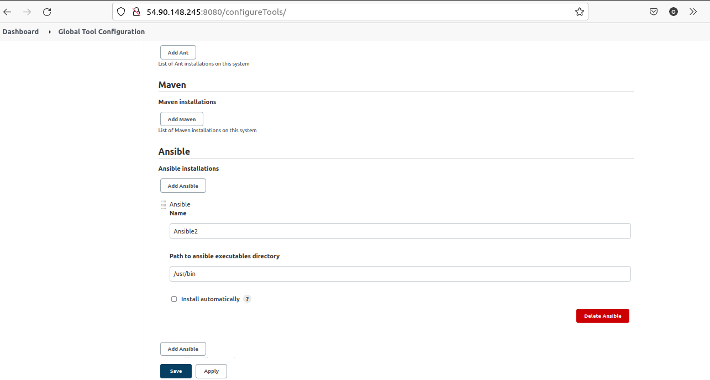

# PROJECT 14 - EXPERIENCE CONTINUOUS INTEGRATION WITH JENKINS | ANSIBLE | ARTIFACTORY | SONARQUBE | PHP

- This project is to create a pipeline that simulates continuous integration and delivery for a PHP based application

- Add a SonarQube role: SonarQube is an open-source platform developed by SonarSource for continuous inspection of code quality, it is used to perform automatic reviews with static analysis of code to detect bugs, code smells, and security vulnerabilities.

- Add a Artifactory role: Artifactory is a product by JFrog that serves as a binary repository manager. The binary repository is a natural extension to the source code repository, in that the outcome of your build process is stored. It can be used for certain other automation, but we will it strictly to manage our build artifacts.

## Configuring Ansible For Jenkins Deployment

- Install Blue Ocean plugin in Jenkins Manage Jenkins and open it when installed.

- Select 'create a new pipeline'

  

  

- Create a new directory 'deploy' and start a new file 'Jenkinsfile' inside the directory

- Add the code snippet below to start building the Jenkinsfile gradually. This pipeline currently has just one stage called Build and the only thing we are doing is using the shell script module to echo Building Stage.

```
pipeline {
    agent any

    stages {
      stage('Build') {
        steps {
          script {
            sh 'echo "Building Stage"'
          }
        }
      }
    }
}
```

- Push code to the main repository.

- Go back into the Ansible_config_mgt pipeline in Jenkins, and select 'configure'

  

- In the configure section , go to the build configuration under Script path and specify the path were the jenkinsfile is, then save the settings.

  

- This pipeline is a multibranch one, which means that if there were more than one branch in GitHub, Jenkins would have scanned the repository to discover them all and we would have been able to trigger a build for each branch

- Create a new git branch and name it feature/jenkinspipeline-stages

  ```
  git checkout -b feature/jenkinspipeline-stages
  ```

- Enter the below code snippet below an push the new changes

  ```
  pipeline {
    agent any

    stages {
      stage('Build') {
        steps {
          script {
            sh 'echo "Building Stage"'
          }
        }
      }

    stage('Test') {
      steps {
        script {
          sh 'echo "Testing Stage"'
        }
      }
    }
   }
  }
  ```

- To ensure that Jenkins detects our new branch, go to the ansible-config-mgt jobs and click on Scan Repository and refresh the page to show the new branch.

  

  

- For every job created in Jenkins, it creates a workspace for each job, thus if Jenkins perform a lot of job lots of workspace will be created which will affect storage. To avoid this type of issue, its a good practice to ensure that at the beginning of the Jenkinsfile you clean the workspace and at the end also.

- Copy the content below in the Jenkinsfile and push the code.

  ```
  pipeline {
    agent any

  stages {
    stage("Initial cleanup") {
          steps {
            dir("${WORKSPACE}") {
              deleteDir()
            }
          }
        }
    stage('Build') {
      steps {
        script {
          sh 'echo "Building Stage"'
        }
      }
    }

    stage('Test') {
      steps {
        script {
          sh 'echo "Testing Stage"'
        }
      }
    }

    stage('Package'){
      steps {
        script {
          sh 'echo "Packaging Stage" '
        }
      }
    }

    stage('Deploy'){
      steps {
        script {
          sh 'echo "Deploying Stage"'
        }
      }

    }

    stage('CleanUp'){
      steps {
        script {
          sh 'echo "Clean Up Stage"'
        }
      }

    }
  }
  ```

  

- After installing ansible plugin in the Jenkins UI, go to global tool configuration under Ansible. Give descriptive name and path to ansible executable folder. You can retrieve this with the which ansible command. copy the path ignoring the ansible part.

  

- In the deploy folder, create a file name ansible.cfg file and copy the content below inside the file. By default when we install ansible, we have the default configuration file in /etc/ansible/ansible.cfg, now we are creating our own config file

```
[defaults]
timeout = 160
callback_whitelist = profile_tasks
log_path=~/ansible.log
host_key_checking = False
gathering = smart
ansible_python_interpreter=/usr/bin/python3
allow_world_readable_tmpfiles=true

[ssh_connection]
ssh_args = -o ControlMaster=auto -o ControlPersist=30m -o ControlPath=/tmp/ansible-ssh-%h-%p-%r -o ServerAliveInterval=60 -o ServerAliveCountMax=60 -o ForwardAgent=yes
```

- Jenkins needs to export the ANSIBLE_CONFIG environment variable, which must be declared globally and specifies where ansible.cfg file is. The code below will be put into the jenkins file.

  ```
  environment {
  ANSIBLE_CONFIG="${WORKSPACE}/deploy/ansible.cfg"
  }
  ```

- To run Ansible playbook via the Jenkinsfile, go to Dashoard -> Manage Jenkins -> Manage Credentials -> Credentials -> Add Credentials. Fill in the blanks, by entering content of the pem key and username (ubuntu or ec-user) To ensure our ansible run against inventory/dev

  

- Go to Dashboard -> ansib-config -> Pipeline Sytnax, configure path to the playbook and inventory path, ssh-user and colorized output. Generate pipeline script, copy the script and paste in the Jenkinsfile.

  

- Copy the code below into the Jenkinsfile

```
 pipeline {
  agent any

  environment {
      ANSIBLE_CONFIG="${WORKSPACE}/deploy/ansible.cfg"
    }

  stages{
      stage("Initial cleanup") {
          steps {
            dir("${WORKSPACE}") {
              deleteDir()
            }
          }
        }

      stage('Checkout SCM') {
         steps{
            git branch: 'feature/jenkinspipeline-stages', url: 'https://github.com/gbejula/ansible-config.git'
         }
       }

      stage('Prepare Ansible For Execution') {
        steps {
          sh 'echo ${WORKSPACE}'
          sh 'sed -i "3 a roles_path=${WORKSPACE}/roles" ${WORKSPACE}/deploy/ansible.cfg'
        }
     }

      stage('Run Ansible playbook') {
        steps {
           ansiblePlaybook become: true, colorized: true, credentialsId: 'private-key', disableHostKeyChecking: true, installation: 'ansible', inventory: 'inventory/${inventory}', playbook: 'playbooks/site.yml'
         }
      }

      stage('Clean Workspace after build'){
        steps{
          cleanWs(cleanWhenAborted: true, cleanWhenFailure: true, cleanWhenNotBuilt: true, cleanWhenUnstable: true, deleteDirs: true)
        }
      }
   }

}
```

- Update the inventory/dev file with 2 instances (nginx and db)

- Push the code with the new updates in the Jenkinsfile.

  

  

- If we need to deploy to other environment, manually updating the Jenkinfile is not an option, thus we need to use parametization.

- The parameters need to be global and edit content of 'Run Ansible Playbook'. The parameters block of the code below sets dev as the default value

```
parameters {
      string(name: 'inventory', defaultValue: 'dev',  description: 'This is the inventory file for the environment to deploy configuration')
    }

 stage('Run Ansible playbook') {
    steps {
       ansiblePlaybook become: true, colorized: true, credentialsId: 'private-key', disableHostKeyChecking: true, installation: 'ansible', inventory:'${WORKSPACE}/inventory/${inventory}', playbook: 'playbooks/site.yml'
            }
```

- Merge code with the main branch.

- Since we included parameters in our Jenkinsfile, when you check the branch where the Jenkinfile was launched, you will see "Build with Parameters".

## CI/CD PIPELINE FOR TODO APPLICATION

- The aim is to deploy the application onto servers directly from Artifactory rather than from git.
