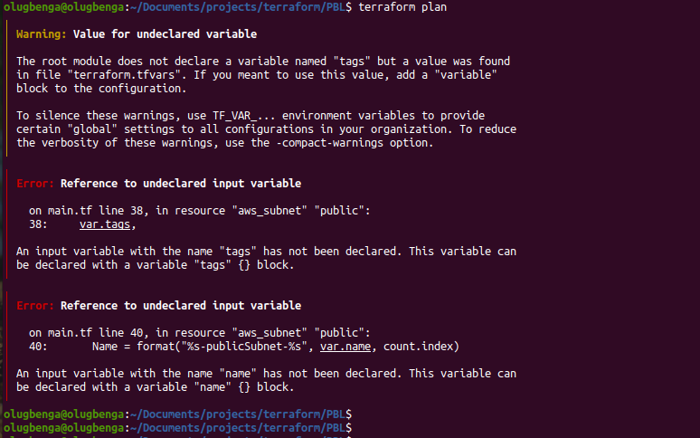
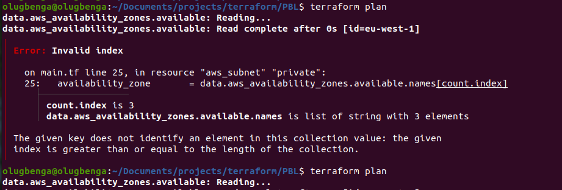
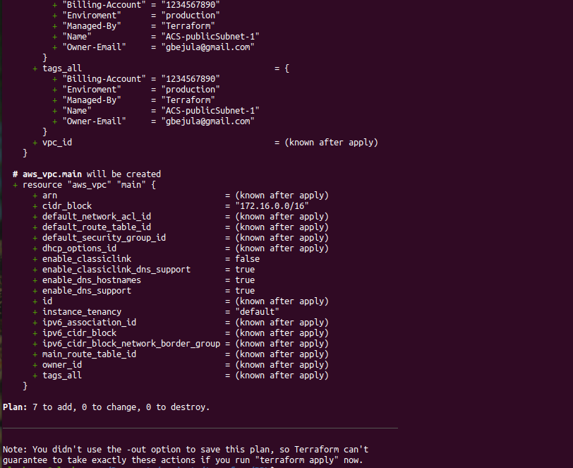
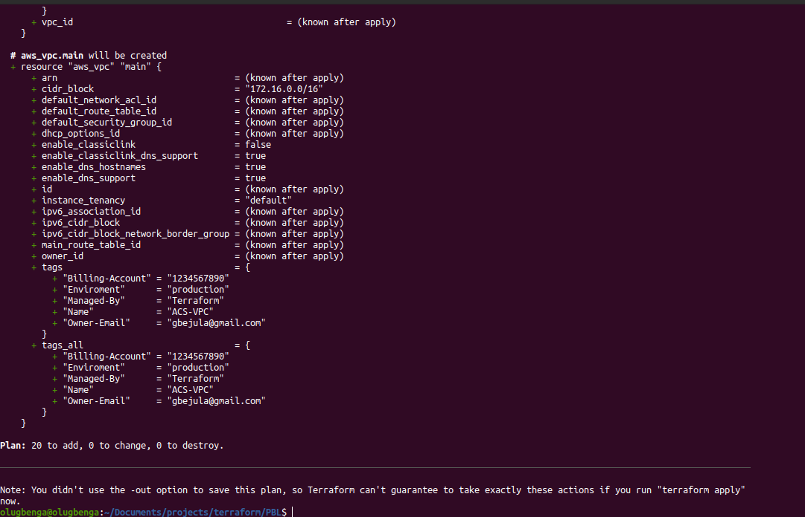

# PROJECT 17: AUTOMATE INFRASTRUCTURE WITH IAC USING TERRAFORM PART 2

This is a continuation of project 16.

- Networking
- Private subnets & best practices

- Create 4 private subnets keeping in mind following principles:

  - Make sure you use variables or length() function to determine the number of AZs
  - Use variables and cidrsubnet() function to allocate vpc_cidr for subnets
  - Keep variables and resources in separate files for better code structure and readability
  - Tags all the resources you have created so far. Explore how to use format() and count functions to automatically tag subnets with its respective number.

- _main.tf_

```
# Create private subnets
resource "aws_subnet" "private" {
  count  = var.preferred_number_of_private_subnets == null ? length(data.aws_availability_zones.available.names) : var.preferred_number_of_private_subnets
  vpc_id = aws_vpc.main.id
  cidr_block              = cidrsubnet(var.vpc_cidr, 8 , count.index + 2)
  map_public_ip_on_launch = true
  availability_zone       = data.aws_availability_zones.available.names[count.index]

}
```

- _variables.tf_

- Add the code below to the variables file

```
variable "preferred_number_of_private_subnets" {
  type = number
  description = "Number of private subnets"
}

```

- Add the code below to the _terraform.tfvars_ to take care of the private subnets

```
preferred_number_of_private_subnets = 4
```

- On the terminal run:

  `terraform plan`

- Got an error when I ran **terraform.plan** to add tags

  

- There is a need to tags all the resources created so far. Explore how to use format() and count functions to automatically tag subnets with its respective number.

- A little bit more about Tagging

  - Resources are much better organized in ‘virtual’ groups
  - They can be easily filtered and searched from console or programmatically
  - Billing team can easily generate reports and determine how much each part of infrastructure costs how much (by department, by type, by environment, etc.)
  - You can easily determine resources that are not being used and take actions accordingly
  - If there are different teams in the organisation using the same account, tagging can help differentiate who owns which resources.

- **Note:** You can add multiple tags as a default set. for example, in out terraform.tfvars file we can have default tags defined.

Edit the following files:

- _main.tf_

```
- For public subnets

# Create public subnets
resource "aws_subnet" "public" {
  count  = var.preferred_number_of_public_subnets == null ? length(data.aws_availability_zones.available.names) : var.preferred_number_of_public_subnets
  vpc_id = aws_vpc.main.id
  cidr_block              = cidrsubnet(var.vpc_cidr, 8 , count.index)
  map_public_ip_on_launch = true
  availability_zone       = data.aws_availability_zones.available.names[count.index]

  tags = merge(
    var.tags,
    {
      Name = format("%s-publicSubnet-%s", var.name, count.index)
    },
  )
}

- For private subnets

# Create private subnets
resource "aws_subnet" "private" {
  count  = var.preferred_number_of_private_subnets == null ? length(data.aws_availability_zones.available.names) : var.preferred_number_of_private_subnets
  vpc_id = aws_vpc.main.id
  cidr_block              = cidrsubnet(var.vpc_cidr, 8 , count.index + 2)
  map_public_ip_on_launch = true
  availability_zone       = data.aws_availability_zones.available.names[count.index]

  tags = merge(
  var.tags,
    {
      Name = format("%s-privatesubnet-%s", var.name, count.index)
    },
  )

}
```

- _variables.tf_

```
variable "name" {
  type = string
  default = "ACS"
}

variable "tags" {
  description = "A mapping of tags to assign to all resources."
  type = map(string)
  default = {}
}
```

- _terraform.tfvars_

```
tags = {
  Enviroment      = "production"
  Owner-Email = "ogaemmanuel@ymail.com"
  Managed-By = "Terraform"
  Billing-Account = "1234567890"
}
```

- Ran **terraform.plan** and got an error severally due to the region choosen

  

- Changed region of the availability zone to **us-east-1** and the error was corrected

  

> ## INTERNET GATEWAYS & FORMAT() FUNCTION

- Create an internet gateway in a separate terraform and the name the file **internet_gateway.tf**

- _internet_gateway.tf_

```
resource "aws_internet_gateway" "ig" {
  vpc_id = aws_vpc.main.id

  tags = merge(
    var.tags,
    {
      Name = format("%s-%s-%s!", var.name, aws_vpc.main.id, "IG")
    },
  )
}
```

- Did you notice how we have used format() function to dynamically generate a unique name for this resource? The first part of the %s takes the interpolated value of aws_vpc.main.id while the second %s appends a literal string IG and finally an exclamation mark is added in the end.

- If any of the resources being created is either using the count function, or creating multiple resources using a loop, then a key-value pair that needs to be unique must be handled differently.

- For example, each of our subnets should have a unique name in the tag section. Without the format() function, we would not be able to see uniqueness. With the format function, each private subnet’s tag will look like this.

> ## NAT GATEWAYS

- Create 1 NAT and 1 Elastic IP (EIP) address. Note that the NAT gateway must be created before the Elastic IP is created.

- The NAT gateways file should be called **natgateway.tf**

```
# Create aws elastic IP

resource "aws_eip" "nat_eip" {
  vpc        = true
  depends_on = [aws_internet_gateway.ig]

  tags = merge(
    var.tags,
    {
      Name = format("%s-EIP-%s", var.name, var.environment)
    },
  )
}

# Create aws nat gateway

resource "aws_nat_gateway" "nat" {
  allocation_id = aws_eip.nat_eip.id
  subnet_id     = element(aws_subnet.public.*.id, 0)
  depends_on    = [aws_internet_gateway.ig]

  tags = merge(
    var.tags,
    {
      Name = format("%s-Nat-%s", var.name, var.environment)
    },
  )
}
```

- _variables.tf_

```
variable "environment" {
  type = string
  description = "Environment"
}
```

- _terraform.tfvars_

```
environment = "dev"
```

- Run from the terminal - **terraform.plan**

  

> ## AWS ROUTES

- Create a file called **route_tables.tf** and use it to create routes for both public and private subnets, create the below resources. Ensure they are properly tagged.

  - aws_route_table
  - aws_route
  - aws_route_table_association

  <br>

- _route_tables.tf_

```
# create private route table
resource "aws_route_table" "private-rtb" {
  vpc_id = aws_vpc.main.id

  tags = merge(
    var.tags,
    {
      Name = format("%s-Private-Route-Table-%s", var.name, var.environment)
    },
  )
}

# create route for the private route table and attach the nat gateway to it
resource "aws_route" "private-rtb-route" {
  route_table_id         = aws_route_table.private-rtb.id
  destination_cidr_block = "0.0.0.0/0"
  gateway_id             = aws_nat_gateway.nat.id
}

# associate all private subnets to the private route table
resource "aws_route_table_association" "private-subnets-assoc" {
  count          = length(aws_subnet.private[*].id)
  subnet_id      = element(aws_subnet.private[*].id, count.index)
  route_table_id = aws_route_table.private-rtb.id
}

# create route table for the public subnets
resource "aws_route_table" "public-rtb" {
  vpc_id = aws_vpc.main.id

  tags = merge(
    var.tags,
    {
      Name = format("%s-Public-Route-Table-%s", var.name, var.environment)
    },
  )
}

# create route for the public route table and attach the internet gateway
resource "aws_route" "public-rtb-route" {
  route_table_id         = aws_route_table.public-rtb.id
  destination_cidr_block = "0.0.0.0/0"
  gateway_id             = aws_internet_gateway.ig.id
}

# associate all public subnets to the public route table
resource "aws_route_table_association" "public-subnets-assoc" {
  count          = length(aws_subnet.public[*].id)
  subnet_id      = element(aws_subnet.public[*].id, count.index)
  route_table_id = aws_route_table.public-rtb.id
}
```

- On the terminal, run the terraform plan command:

  

> ## CREATE CERTIFICATE FROM AMAZON CERTIFICATE MANAGER

- Create **cert.tf** and add the following code

**Note:** Ensure to change the domain name to your own domain that is created.

- Check out the terraform documentation for AWS Certificate Manager

- _**cert.tf**_

```
# The entire section create a certiface, public zone, and validate the certificate using DNS method

# Create the certificate using a wildcard for all the domains created in gbejula.click
resource "aws_acm_certificate" "gbejula" {
  domain_name       = "*.gbejula.click"
  validation_method = "DNS"
}

# calling the hosted zone
data "aws_route53_zone" "gbejula" {
  name         = "gbejula.click"
  private_zone = false
}

# selecting validation method
resource "aws_route53_record" "gbejula" {
  for_each = {
    for dvo in aws_acm_certificate.gbejula.domain_validation_options : dvo.domain_name => {
      name   = dvo.resource_record_name
      record = dvo.resource_record_value
      type   = dvo.resource_record_type
    }
  }

  allow_overwrite = true
  name            = each.value.name
  records         = [each.value.record]
  ttl             = 60
  type            = each.value.type
  zone_id         = data.aws_route53_zone.gbejula.zone_id
}

# validate the certificate through DNS method
resource "aws_acm_certificate_validation" "gbejula" {
  certificate_arn         = aws_acm_certificate.gbejula.arn
  validation_record_fqdns = [for record in aws_route53_record.gbejula : record.fqdn]
}

# create records for tooling
resource "aws_route53_record" "tooling" {
  zone_id = data.aws_route53_zone.gbejula.zone_id
  name    = "tooling.gbejula.click"
  type    = "A"

  alias {
    name                   = aws_lb.ext-alb.dns_name
    zone_id                = aws_lb.ext-alb.zone_id
    evaluate_target_health = true
  }
}

# create records for wordpress
resource "aws_route53_record" "wordpress" {
  zone_id = data.aws_route53_zone.gbejula.zone_id
  name    = "wordpress.gbejula.click"
  type    = "A"

  alias {
    name                   = aws_lb.ext-alb.dns_name
    zone_id                = aws_lb.ext-alb.zone_id
    evaluate_target_health = true
  }
}
```

> ## CREATE SECURITY GROUP

- Create a security group in file and reference this security group within each resources that needs it.

- The file name will be **security.tf**

- It is important to check the terraform documentation for [security group](https://registry.terraform.io/providers/hashicorp/aws/latest/docs/resources/security_group) and [security group rule](https://registry.terraform.io/providers/hashicorp/aws/latest/docs/resources/security_group_rule)

_security.tf_

```
# security group for alb, to allow acess from any where for HTTP and HTTPS traffic
resource "aws_security_group" "ext-alb-sg" {
  name        = "ext-alb-sg"
  vpc_id      = aws_vpc.main.id
  description = "Allow TLS inbound traffic"

  ingress {
    description = "HTTP"
    from_port   = 80
    to_port     = 80
    protocol    = "tcp"
    cidr_blocks = ["0.0.0.0/0"]
  }

  ingress {
    description = "HTTPS"
    from_port   = 22
    to_port     = 22
    protocol    = "tcp"
    cidr_blocks = ["0.0.0.0/0"]
  }

  egress {
    from_port   = 0
    to_port     = 0
    protocol    = "-1"
    cidr_blocks = ["0.0.0.0/0"]
  }

 tags = merge(
    var.tags,
    {
      Name = "ext-alb-sg"
    },
  )

}

# security group for bastion, to allow access into the bastion host from you IP
resource "aws_security_group" "bastion_sg" {
  name        = "vpc_web_sg"
  vpc_id = aws_vpc.main.id
  description = "Allow incoming HTTP connections."

  ingress {
    description = "SSH"
    from_port   = 22
    to_port     = 22
    protocol    = "tcp"
    cidr_blocks = ["0.0.0.0/0"]
  }

  egress {
    from_port   = 0
    to_port     = 0
    protocol    = "-1"
    cidr_blocks = ["0.0.0.0/0"]
  }

   tags = merge(
    var.tags,
    {
      Name = "Bastion-SG"
    },
  )
}

#security group for nginx reverse proxy, to allow access only from the extaernal load balancer and bastion instance
resource "aws_security_group" "nginx-sg" {
  name   = "nginx-sg"
  vpc_id = aws_vpc.main.id

  egress {
    from_port   = 0
    to_port     = 0
    protocol    = "-1"
    cidr_blocks = ["0.0.0.0/0"]
  }

   tags = merge(
    var.tags,
    {
      Name = "nginx-SG"
    },
  )
}

resource "aws_security_group_rule" "inbound-nginx-http" {
  type                     = "ingress"
  from_port                = 443
  to_port                  = 443
  protocol                 = "tcp"
  source_security_group_id = aws_security_group.ext-alb-sg.id
  security_group_id        = aws_security_group.nginx-sg.id
}

resource "aws_security_group_rule" "inbound-bastion-ssh" {
  type                     = "ingress"
  from_port                = 22
  to_port                  = 22
  protocol                 = "tcp"
  source_security_group_id = aws_security_group.bastion_sg.id
  security_group_id        = aws_security_group.nginx-sg.id
}

# security group for ialb, to have acces only from nginx reverser proxy server
resource "aws_security_group" "int-alb-sg" {
  name   = "my-alb-sg"
  vpc_id = aws_vpc.main.id

  egress {
    from_port   = 0
    to_port     = 0
    protocol    = "-1"
    cidr_blocks = ["0.0.0.0/0"]
  }

  tags = merge(
    var.tags,
    {
      Name = "int-alb-sg"
    },
  )

}

resource "aws_security_group_rule" "inbound-ialb-https" {
  type                     = "ingress"
  from_port                = 443
  to_port                  = 443
  protocol                 = "tcp"
  source_security_group_id = aws_security_group.nginx-sg.id
  security_group_id        = aws_security_group.int-alb-sg.id
}

# security group for webservers, to have access only from the internal load balancer and bastion instance
resource "aws_security_group" "webserver-sg" {
  name   = "my-asg-sg"
  vpc_id = aws_vpc.main.id

  egress {
    from_port   = 0
    to_port     = 0
    protocol    = "-1"
    cidr_blocks = ["0.0.0.0/0"]
  }

  tags = merge(
    var.tags,
    {
      Name = "webserver-sg"
    },
  )

}

resource "aws_security_group_rule" "inbound-web-https" {
  type                     = "ingress"
  from_port                = 443
  to_port                  = 443
  protocol                 = "tcp"
  source_security_group_id = aws_security_group.int-alb-sg.id
  security_group_id        = aws_security_group.webserver-sg.id
}

resource "aws_security_group_rule" "inbound-web-ssh" {
  type                     = "ingress"
  from_port                = 22
  to_port                  = 22
  protocol                 = "tcp"
  source_security_group_id = aws_security_group.bastion_sg.id
  security_group_id        = aws_security_group.webserver-sg.id
}

# security group for datalayer to alow traffic from websever on nfs and mysql port and bastiopn host on mysql port
resource "aws_security_group" "datalayer-sg" {
  name   = "datalayer-sg"
  vpc_id = aws_vpc.main.id

  egress {
    from_port   = 0
    to_port     = 0
    protocol    = "-1"
    cidr_blocks = ["0.0.0.0/0"]
  }

 tags = merge(
    var.tags,
    {
      Name = "datalayer-sg"
    },
  )
}

resource "aws_security_group_rule" "inbound-nfs-port" {
  type                     = "ingress"
  from_port                = 2049
  to_port                  = 2049
  protocol                 = "tcp"
  source_security_group_id = aws_security_group.webserver-sg.id
  security_group_id        = aws_security_group.datalayer-sg.id
}

resource "aws_security_group_rule" "inbound-mysql-bastion" {
  type                     = "ingress"
  from_port                = 3306
  to_port                  = 3306
  protocol                 = "tcp"
  source_security_group_id = aws_security_group.bastion_sg.id
  security_group_id        = aws_security_group.datalayer-sg.id
}

resource "aws_security_group_rule" "inbound-mysql-webserver" {
  type                     = "ingress"
  from_port                = 3306
  to_port                  = 3306
  protocol                 = "tcp"
  source_security_group_id = aws_security_group.webserver-sg.id
  security_group_id        = aws_security_group.datalayer-sg.id
}
```

> ## CREATE AN EXTERNAL (INTERNET FACING) APPLICATION LOAD BALANER (ALB)

- Create a file called **alb.tf**

- The ALB will be create first, then target group and lastly the listener rule

- For more information, check the terraform documentation for

  - [ALB](https://registry.terraform.io/providers/hashicorp/aws/latest/docs/resources/lb)
  - [ALB-target](https://registry.terraform.io/providers/hashicorp/aws/latest/docs/resources/lb_target_group)
  - [ALB-listener](https://registry.terraform.io/providers/hashicorp/aws/latest/docs/resources/lb_listener)

- The ALB is created to balance the traffic between the instances

- _**alb.tf**_

```
resource "aws_lb" "ext-alb" {
  name     = "ext-alb"
  internal = false
  security_groups = [
    aws_security_group.ext-alb-sg.id,
  ]

  subnets = [
    aws_subnet.public[0].id,
    aws_subnet.public[1].id
  ]

   tags = merge(
    var.tags,
    {
      Name = "ACS-ext-alb"
    },
  )

  ip_address_type    = "ipv4"
  load_balancer_type = "application"
}

# Target group

resource "aws_lb_target_group" "nginx-tgt" {
  health_check {
    interval            = 10
    path                = "/healthstatus"
    protocol            = "HTTPS"
    timeout             = 5
    healthy_threshold   = 5
    unhealthy_threshold = 2
  }
  name        = "nginx-tgt"
  port        = 443
  protocol    = "HTTPS"
  target_type = "instance"
  vpc_id      = aws_vpc.main.id
}

# For listeners

resource "aws_lb_listener" "nginx-listner" {
  load_balancer_arn = aws_lb.ext-alb.arn
  port              = 443
  protocol          = "HTTPS"
  certificate_arn   = aws_acm_certificate_validation.gbejula.certificate_arn

  default_action {
    type             = "forward"
    target_group_arn = aws_lb_target_group.nginx-tgt.arn
  }
}


# ----------------------------
#Internal Load Balancers for webservers
#---------------------------------

resource "aws_lb" "ialb" {
  name     = "ialb"
  internal = true
  security_groups = [
    aws_security_group.int-alb-sg.id,
  ]

  subnets = [
    aws_subnet.private[0].id,
    aws_subnet.private[1].id
  ]

  tags = merge(
    var.tags,
    {
      Name = "ACS-int-alb"
    },
  )

  ip_address_type    = "ipv4"
  load_balancer_type = "application"
}

# --- target group  for wordpress -------

resource "aws_lb_target_group" "wordpress-tgt" {
  health_check {
    interval            = 10
    path                = "/healthstatus"
    protocol            = "HTTPS"
    timeout             = 5
    healthy_threshold   = 5
    unhealthy_threshold = 2
  }

  name        = "wordpress-tgt"
  port        = 443
  protocol    = "HTTPS"
  target_type = "instance"
  vpc_id      = aws_vpc.main.id
}

# --- target group for tooling -------

resource "aws_lb_target_group" "tooling-tgt" {
  health_check {
    interval            = 10
    path                = "/healthstatus"
    protocol            = "HTTPS"
    timeout             = 5
    healthy_threshold   = 5
    unhealthy_threshold = 2
  }

  name        = "tooling-tgt"
  port        = 443
  protocol    = "HTTPS"
  target_type = "instance"
  vpc_id      = aws_vpc.main.id
}

# For this aspect a single listener was created for the wordpress which is default,
# A rule was created to route traffic to tooling when the host header changes

resource "aws_lb_listener" "web-listener" {
  load_balancer_arn = aws_lb.ialb.arn
  port              = 443
  protocol          = "HTTPS"
  certificate_arn   = aws_acm_certificate_validation.gbejula.certificate_arn

  default_action {
    type             = "forward"
    target_group_arn = aws_lb_target_group.wordpress-tgt.arn
  }
}

# listener rule for tooling target

resource "aws_lb_listener_rule" "tooling-listener" {
  listener_arn = aws_lb_listener.web-listener.arn
  priority     = 99

  action {
    type             = "forward"
    target_group_arn = aws_lb_target_group.tooling-tgt.arn
  }

  condition {
    host_header {
      values = ["tooling.gbejula.click"]
    }
  }
}
```

- Run terraform plan and terraform apply --auto-approve

> ## AWS IDENTITY AND ACCESS MANAGEMENT

- IAM and Roles

- Create a file for roles - _roles.tf_

```
resource "aws_iam_role" "ec2_instance_role" {
name = "ec2_instance_role"
  assume_role_policy = jsonencode({
    Version = "2012-10-17"
    Statement = [
      {
        Action = "sts:AssumeRole"
        Effect = "Allow"
        Sid    = ""
        Principal = {
          Service = "ec2.amazonaws.com"
        }
      },
    ]
  })

  tags = merge(
    var.tags,
    {
      Name = "aws assume role"
    },
  )
}


#  IAM policy roles
resource "aws_iam_policy" "policy" {
  name        = "ec2_instance_policy"
  description = "A test policy"
  policy = jsonencode({
    Version = "2012-10-17"
    Statement = [
      {
        Action = [
          "ec2:Describe*",
        ]
        Effect   = "Allow"
        Resource = "*"
      },
    ]

  })

  tags = merge(
    var.tags,
    {
      Name =  "aws assume policy"
    },
  )

}

resource "aws_iam_role_policy_attachment" "test-attach" {
  role       = aws_iam_role.ec2_instance_role.name
  policy_arn = aws_iam_policy.policy.arn
}

resource "aws_iam_instance_profile" "ip" {
  name = "aws_instance_profile_test"
  role = aws_iam_role.ec2_instance_role.name
}
```

- Afterwards, run terraform plan

- We need to configure the Auto Scaling Group (ASG) for EC2 depending on the application traffic.

- Create asg-bastioin-nginx.tf

```
# Get list of availability zones
data "aws_availability_zones" "available-bastion" {
  state = "available"
}

# creating sns topic for all the auto scaling groups
resource "aws_sns_topic" "ACS-sns" {
  name = "Default_CloudWatch_Alarms_Topic"
}


# creating notification for all the auto scaling groups
resource "aws_autoscaling_notification" "aws_notifications" {
  group_names = [
    aws_autoscaling_group.bastion-asg.name,
    aws_autoscaling_group.nginx-asg.name,
    aws_autoscaling_group.wordpress-asg.name,
    aws_autoscaling_group.tooling-asg.name,
  ]
  notifications = [
    "autoscaling:EC2_INSTANCE_LAUNCH",
    "autoscaling:EC2_INSTANCE_TERMINATE",
    "autoscaling:EC2_INSTANCE_LAUNCH_ERROR",
    "autoscaling:EC2_INSTANCE_TERMINATE_ERROR",
  ]

  topic_arn = aws_sns_topic.ACS-sns.arn
}


resource "random_shuffle" "az_list" {
  input = data.aws_availability_zones.available-bastion.names
}


resource "aws_launch_template" "bastion-launch-template" {
  name                   = "bastion-launch-template"
  instance_type          = "t2.micro"
  image_id               = var.ami
  vpc_security_group_ids = [aws_security_group.bastion-sg.id]

  iam_instance_profile {
    name = aws_iam_instance_profile.ip.id
  }

  key_name = var.keypair

  placement {
    availability_zone = "random_shuffle.az_list.result"
  }

  lifecycle {
    create_before_destroy = true
  }

  tag_specifications {
    resource_type = "instance"

    tags = {
      Name = "bastion-launch-template"
    }
  }

  user_data = filebase64("${path.module}/bastion.sh")
}


# ---- Autoscaling for bastion  hosts


resource "aws_autoscaling_group" "bastion-asg" {
  name                      = "bastion-asg"
  max_size                  = 2
  min_size                  = 2
  health_check_grace_period = 300
  health_check_type         = "ELB"
  desired_capacity          = 2

  # Where you place in your subnet
  vpc_zone_identifier = [aws_subnet.public[0].id, aws_subnet.public[1].id]

  launch_template {
    id      = aws_launch_template.bastion-launch-template.id
    version = "$Latest"
  }
  tag {
    key                 = "Name"
    value               = "ACS-Bastion"
    propagate_at_launch = true
  }

}

resource "aws_launch_template" "nginx-launch-template" {
  name                   = "nginx-launch-template"
  instance_type          = "t2.micro"
  image_id               = var.ami
  vpc_security_group_ids = [aws_security_group.nginx-sg.id]

  iam_instance_profile {
    name = aws_iam_instance_profile.ip.id
  }

  key_name = var.keypair

  placement {
    availability_zone = "random_shuffle.az_list.result"
  }

  lifecycle {
    create_before_destroy = true
  }

  tag_specifications {
    resource_type = "instance"

    tags = {
      Name = "nginx-launch-template"
    }
  }

  user_data = filebase64("${path.module}/nginx.sh")
}


# ------ Autoscslaling group for reverse proxy nginx ---------

resource "aws_autoscaling_group" "nginx-asg" {
  name                      = "nginx-asg"
  max_size                  = 2
  min_size                  = 1
  health_check_grace_period = 300
  health_check_type         = "ELB"
  desired_capacity          = 1

  vpc_zone_identifier = [aws_subnet.public[0].id, aws_subnet.public[1].id]

  launch_template {
    id      = aws_launch_template.nginx-launch-template.id
    version = "$Latest"
  }

  tag {
    key                 = "Name"
    value               = "ACS-nginx"
    propagate_at_launch = true
  }


}

# attaching autoscaling group of nginx to external load balancer
resource "aws_autoscaling_attachment" "asg_attachment_nginx" {
  autoscaling_group_name = aws_autoscaling_group.nginx-asg.id
  alb_target_group_arn   = aws_lb_target_group.nginx-tgt.arn
}
```

- We define the variables for the above

```
variable "ami" {
  type        = string
  description = "AMI ID for the launch template"
}

variable "keypair" {
  type        = string
  description = "Key pair for the instances"
}

variable "account_no" {
  type        = number
  description = "the account number"
}
```

- terraform.tfvars

```
ami = "ami-0fb653ca2d3203ac1"

keypair = "EC2 Tutorial"
```

- Bastion.sh:userdata

```
#!/bin/bash
yum install -y mysql
yum install -y git tmux
yum install -y ansible
```

- nginx.sh: userdata

```
#!/bin/bash
yum install -y nginx
systemctl start nginx
systemctl enable nginx
git clone https://github.com/Taiwolawal/ACS-project-config.git
mv /ACS-project-config/reverse.conf /etc/nginx/
mv /etc/nginx/nginx.conf /etc/nginx/nginx.conf-distro
cd /etc/nginx/
touch nginx.conf
sed -n 'w nginx.conf' reverse.conf
systemctl restart nginx
rm -rf reverse.conf
rm -rf /ACS-project-config
```
