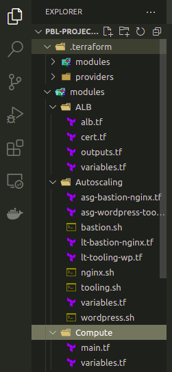
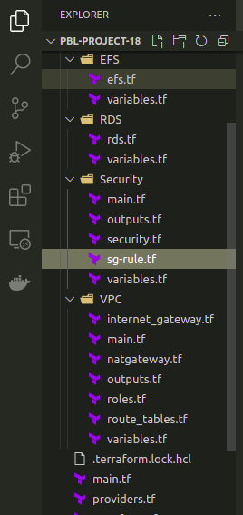

# PROJECT 18: AUTOMATE INFRASTRUCTURE WITH IAC USING TERRAFORM PART 3 – Refactoring

We will configure the following:

- Add S3 and DynamoDB resource blocks before deleting the local state file
- Update terraform block to introduce backend and locking
- Re-initialize terraform
- Delete the local tfstate file and check the one in S3 bucket
- Add outputs
- Terrform apply

- Create a file, name it **main.tf** in the root directory.

```
# Note: The bucket name may not work for you since buckets are unique globally in AWS, so you must give it a unique name.
resource "aws_s3_bucket" "terraform_state" {
  bucket = "dev-terraform-bucket"
  # Enable versioning so we can see the full revision history of our state files
  versioning {
    enabled = true
  }
  # Enable server-side encryption by default
  server_side_encryption_configuration {
    rule {
      apply_server_side_encryption_by_default {
        sse_algorithm = "AES256"
      }
    }
  }
}

resource "aws_dynamodb_table" "terraform_locks" {
  name         = "terraform-locks"
  billing_mode = "PAY_PER_REQUEST"
  hash_key     = "LockID"
  attribute {
    name = "LockID"
    type = "S"
  }
}
```

- Break down your Terraform codes to have all resources in their respective modules. Combine resources of a similar type into directories within a ‘modules’ directory, for example, like this:

```
- modules
  - ALB: For Apllication Load balancer and similar resources
  - EFS: For Elastic file system resources
  - RDS: For Databases resources
  - Autoscaling: For Autosacling and launch template resources
  - compute: For EC2 and rlated resources
  - VPC: For VPC and netowrking resources such as subnets, roles, e.t.c.
  - security: for creating security group resources
```

- Each module shall contain the one or more of the following files:

```
- main.tf (or %resource_name%.tf) file(s) with resources blocks
- outputs.tf (optional, if you need to refer outputs from any of these resources in your root module)
- variables.tf (as we learned before - it is a good practice not to hard code the values and use variables)
```

- It is also recommended to configure providers and backends sections in separate files but should be placed in the root module.

**IMPORTANT**: In the configuration sample from the repository, you can observe two examples of referencing the module:

In the configuration sample from the repository, you can observe two examples of referencing the module:

```
module "VPC" {
  source = "./modules/VPC"
  region = var.region
  ...
```

> ## COMPLETE THE TERRAFORM CONFIGURATION

- Create a new folder module

_File structure for project 18_




- Run the following commands to create the resources in AWS console

```
# To format the terraform codes
terraform fmt

# Check the validity of the code for errors
terraform validate

# create the plans
terraform plan

# apply the created plan if everything looks fine
terraform apply --auto-approve
```

- See the resources created.
