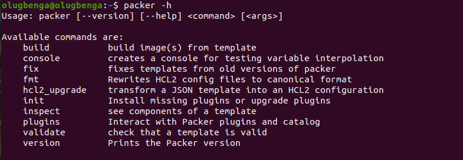
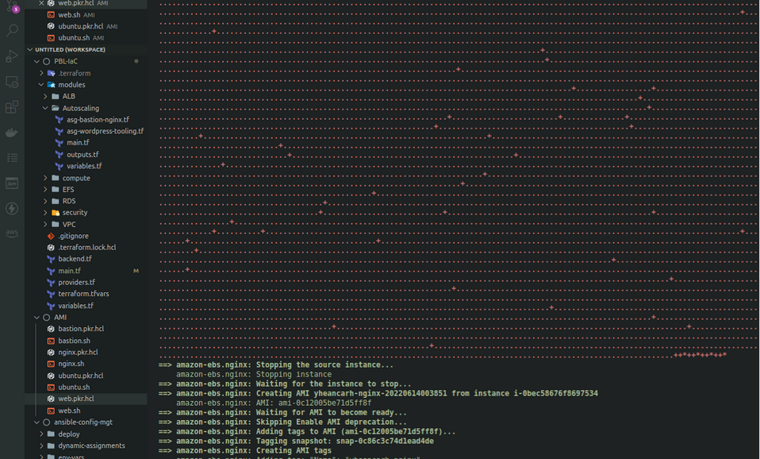
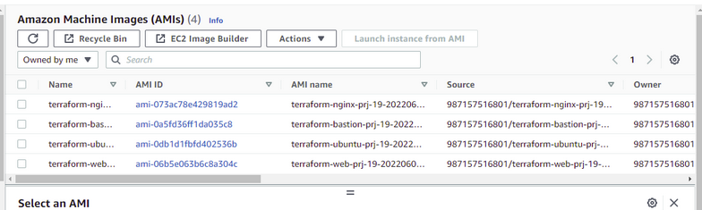
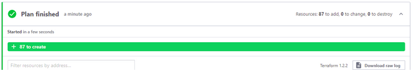
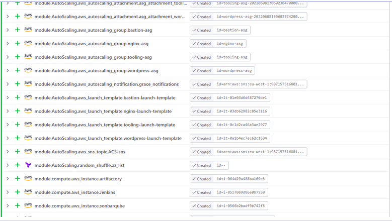
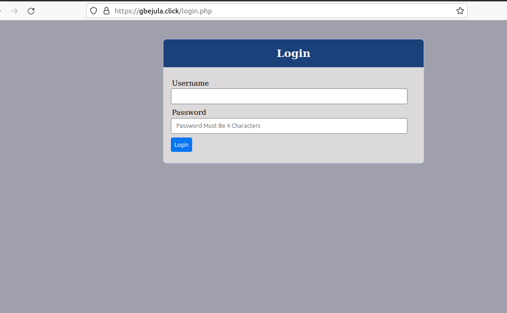
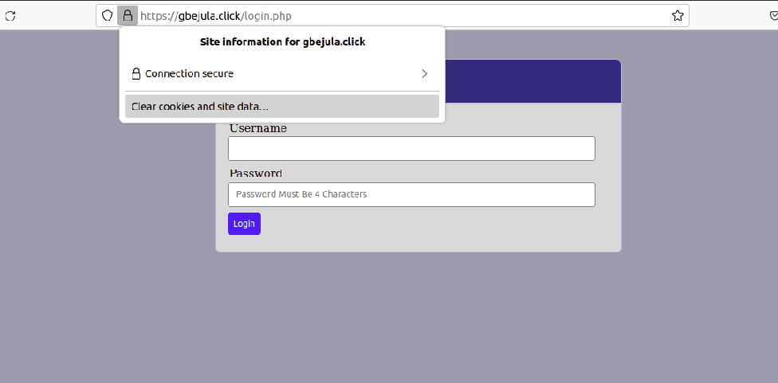
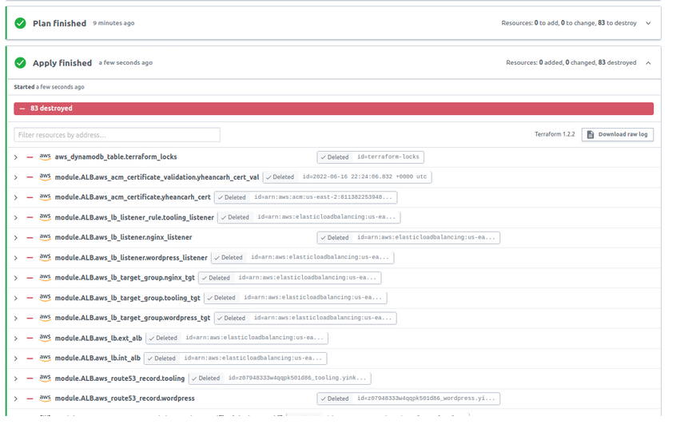

# PROJECT 19: AUTOMATE INFRASTRUCTURE WITH IAC USING TERRAFORM - PART 4

- Migrate codes to Terraform cloud.

- Created a terraform cloud action

- Created an organization

- Configured variable

- Installed packer on computer



- Build AMIs with packer

- Ran the following packer command

```
packer build bastion.pkr.hcl
packer build web.pkr.hcl
packer build nginx.pkr.hcl
packer build ubuntu.pkr.hcl
```



- AMIs created in AWS console.



- Initiate the following command below from the web console

```
terraform plan
terraform apply
```





- Website opened in the browser to confirm working.





- Terraform destroyed


