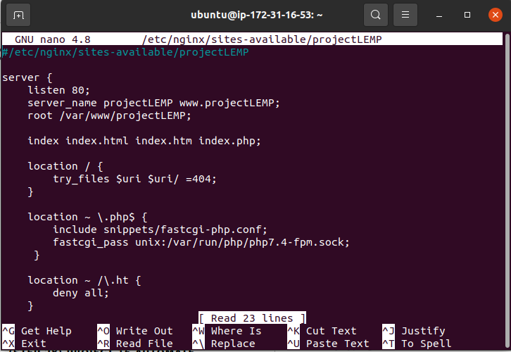
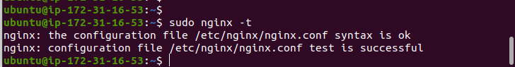
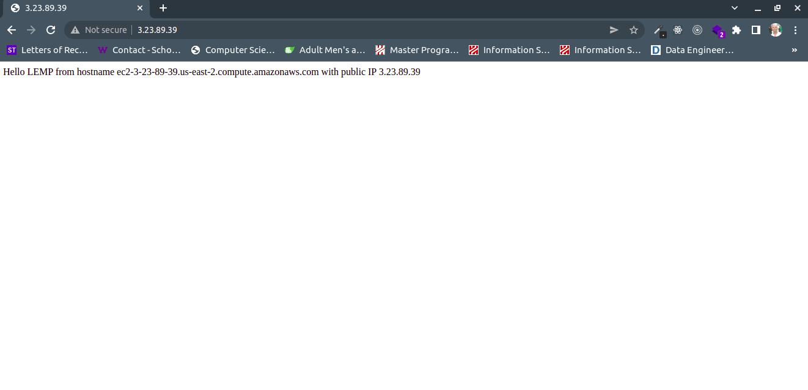
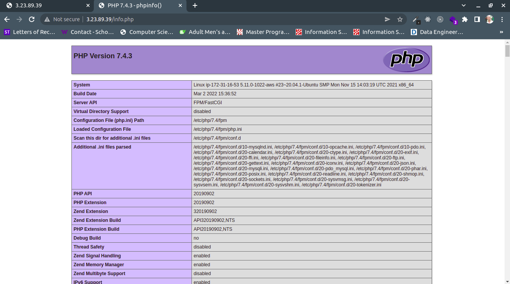

## Project 2: LEMP Stack Implementation

> Step 1 -- Installing the Nginx web server

- sudo apt install nginx

  `sudo apt install nginx`

  

> Verify nginx was successfully installed

- sudo systemctl status nginx

  `sudo systemctl status nginx`

> Access the server locally in the Ubuntu terminal

- curl http://localhost:80
  `curl http://localhost:80`

  

> Access the server on the web browser using the public url


> Step 2 -- Installing MySQL

- sudo apt install mysql-server

  `sudo apt install mysql-server`

> Run security script to make MySql secure

- sudo mysql_secure_installation

  `sudo mysql_secure_installation`

  

> Exit MySql console

`exit`

> Step 3 -- Installing PHP

- sudo apt install php-fpm php-mysql

  `sudo apt install php-fpm php-mysql`
  

> Step 4 - Configuring Nginx to use PHP Processor

- Create the root web directory for my domain

  `sudo mkdir /var/ww w/projectLEMP`

- Assign ownership of the directory with the $USER environment variable

  `sudo chown -R $USER:$USER /var/www/projectLEMP`

- Then, open a new configuration file in Nginx’s sites-available directory using your preferred command-line editor.

  `sudo nano /etc/nginx/sites-available/projectLEMP`

> Create a new blank file



- Activate your configuration by linking to the config file from Nginx’s sites-enabled directory:

  `sudo ln -s /etc/nginx/sites-available/projectLEMP /etc/nginx/sites-enabled/`

- Test my configuration for syntax error

  `sudo nginx -t`
  

- Disable default Nginx host that is currently configured to listen on port 80

  `sudo unlink /etc/nginx/sites-enabled/default`

- Reload Nginx to apply changes:

  `sudo systemctl reload nginx`

- Create an index.html file in that location so that we can test that your new server block works as expected:

  ```
  sudo echo 'Hello LEMP from hostname' $(curl -s http://169.254.169.254/latest/meta-data/public-hostname) 'with public IP' $(curl -s http://169.254.169.254/latest/meta-data/public-ipv4) > /var/www/projectLEMP/index.html

  ```

- Open the browser and access the website with the URL using the IP address

  

> Step 5 -- Testing PHP with NGINX

- Create a test PHP file in the document root

  `sudo nano /var/www/projectLEMP/info.php`

- Check php info

  ```
  <?php
  phpinfo();

  ```

  

- Remove sensitive php info

  `sudo rm /var/www/your_domain/info.php`
