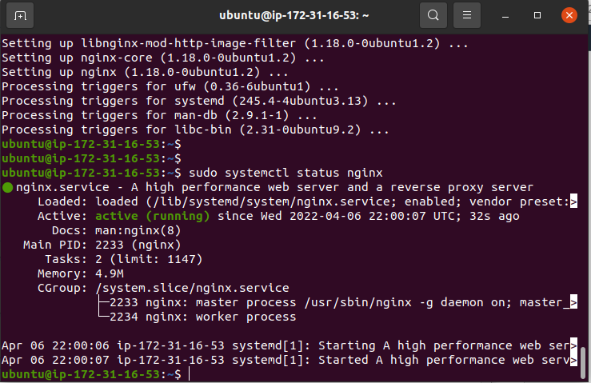
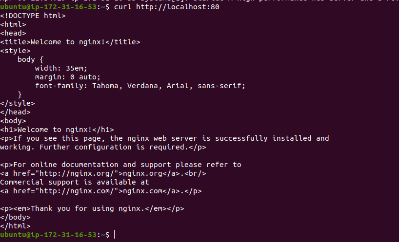
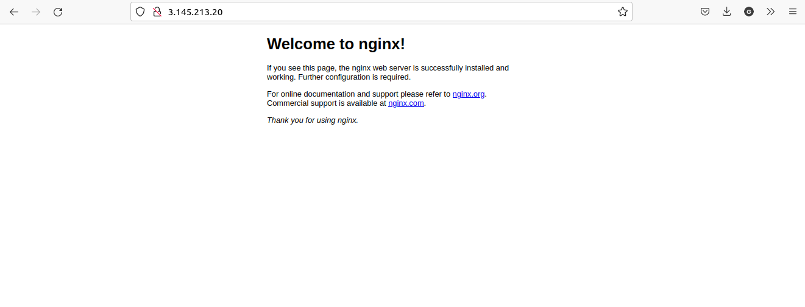
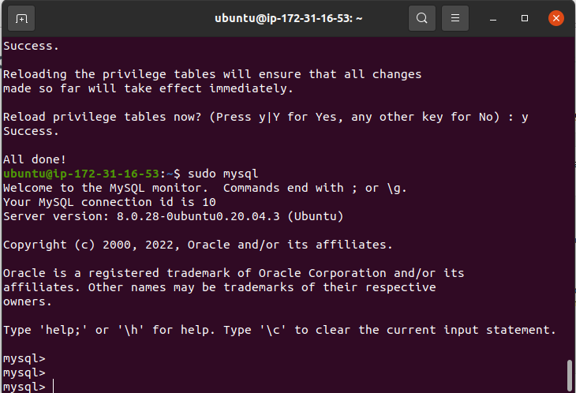
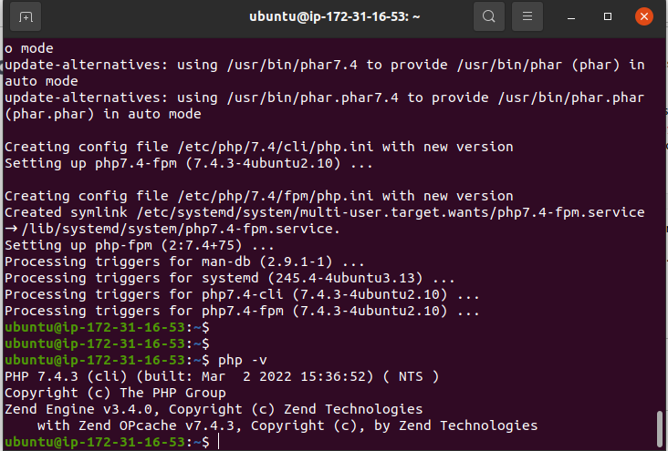

## Project 2: LEMP Stack Implementation

> Step 1 -- Installing the Nginx web server

- sudo apt install nginx

`sudo apt install nginx`

> Verify nginx was successfully installed

- sudo systemctl status nginx

`sudo systemctl status nginx`

> Access the server locally in the Ubuntu terminal

- curl http://localhost:80
  `curl http://localhost:80`

> Access the server on the web browser using the public url

> Step 2 -- Installing MySQL

- sudo apt install mysql-server

`sudo apt install mysql-server`

> Run security script to make MySql secure

- sudo mysql_secure_installation

`sudo mysql_secure_installation`

> Step 3 -- Installing PHP

- sudo apt install php-fpm php-mysql
  `sudo apt install php-fpm php-mysql`
  

> Exit MySql console

`exit`
