# PROJECT 20: MIGRATION TO THE CLOUD WITH CONTAINERIZATION PART 1 - DOCKER & DOCKER COMPOSE.

- **Install Docker and prepare for migration to the Cloud**

- Install Docker Engine, which is a client-server application that contains:

- A server with a long-running daemon process **_dockerd_**.
- APIs that specify interfaces that programs can use to talk to and instruct the Docker daemon.
- A command-line interface (CLI) client **_docker_**.

- Install Docker Engine using either of the following links below

  - first
  - second

- **Remember our Tooling website? It is a PHP-based web solution backed by a MySQL database – all technologies you are already familiar with and which you shall be comfortable using by now.**

- Set up MySQL in container

> ### STEP 1: PULL MYSQL DOCKER IMAGE FROM DOCKER HUB REGISTRY

- Start by pulling the appropriate Docker image for MySQL. You can download a specific version or opt for the latest release, as seen in the following command:

  ```
  docker pull mysql/mysql-server:latest
  ```

  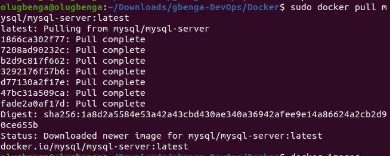

- Check that the image is downloaded successfully.

  ```
  docker image ls
  ```

  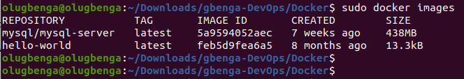

> ### STEP 2: DEPLOY THE MYSQL CONTAINER TO DOCKER ENGINE

- Once the image is available, move on to deploying a new MySQL container with the command below:

  ```
  docker run --name <container_name> -e MYSQL_ROOT_PASSWORD=<my-secret-pw> -d mysql/mysql-server:latest
  ```

  - Replace <container_name> with the name of your choice. If you do not provide a name, Docker will generate a random one
  - The -d option instructs Docker to run the container as a service in the background
  - Replace <my-secret-pw> with your chosen password
  - In the command above, we used the latest version tag. This tag may differ according to the image you downloaded

- Check the MySQL container that is running using the command:

  ```
  docker ps -a
  ```

  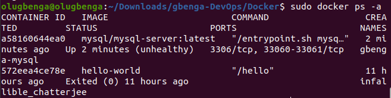

> ### Step 3: Connecting to the MySQL Docker Container

Approach 1

- Connecting directly to the container running the MySQL server:

```
docker exec -it mysql bash

or

$ docker exec -it mysql mysql -uroot -p
```

Provide the root password when prompted. With that, you’ve connected the MySQL client to the server.

Finally, change the server root password to protect your database. Exit the the shell with exit command Flags used

- exec used to execute a command from bash itself
- -it makes the execution interactive and allocate a pseudo-TTY
- bash this is a unix shell and its used as an entry-point to interact with our container
- mysql The second mysql in the command "docker exec -it mysql mysql -uroot -p" serves as the entry point to interact with mysql container just like bash or sh
- -u mysql username
- -p mysql password

Approach 2:

- At this stage, we remove the previous mysql docker container since we know how to create a docker container

  ```
  docker ps -a
  docker stop mysql
  docker rm mysql or <container ID> 04a34f46fb98
  ```

  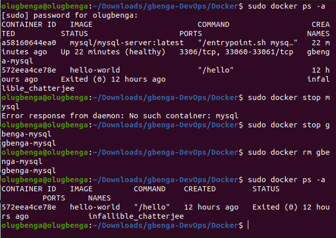

- Verify the container is deleted using:

  ```
  docker ps -a
  ```

- Create a network

  ```
  docker network create --subnet=172.18.0.0/24 tooling_app_network
  ```

  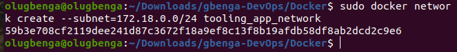

- Creating a custom network is not necessary because even if we do not create a network, Docker will use the default network for all the containers that is run. Hence, verify the running docker network using:

- But there are use cases where this is necessary. For example, if there is a requirement to control the cidr range of the containers running the entire application stack. This will be an ideal situation to create a network and specify the **--subnet**

- For clarity’s sake, we will create a network with a subnet dedicated for our project and use it for both MySQL and the application so that they can connect.

  ```
  docker network ls
  ```

  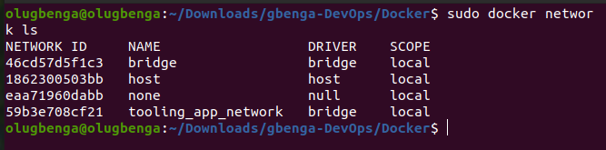

- Run the MySQL Server container using the created network.

- First, let us create an environment variable to store the root password:

  ```
  export MYSQL_PW=xxxxxxx
  The password should follow immediately without a space after the = sign.

  verify the password using echo:

  echo $MYSQL_PW
  ```

- This was my mistake previously as I did not add the password

  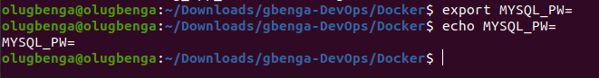

- I later corrected it and added a password

  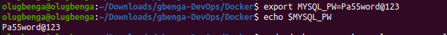

- Then, pull the image and run the container, all in one command like below:

  ```
  docker run --network tooling_app_network -h mysqlserverhost --name=mysql-server -e MYSQL_ROOT_PASSWORD=$MYSQL_PW  -d mysql/mysql-server:latest
  ```

  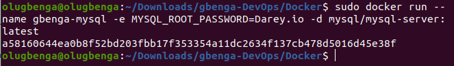

Flags used

- -d runs the container in detached mode
- --network connects a container to a network
- -h specifies a hostname

- Discovered that the container is not running

  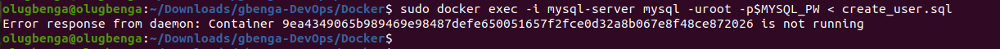

- Then ran, command

  ```
  docker container start name or container ID
  ```

  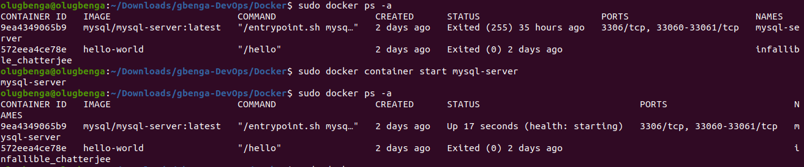

  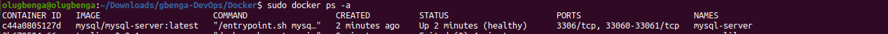

- As you already know, it is best practice not to connect to the MySQL server remotely using the root user. Therefore, we will create an SQL script that will create a user we can use to connect remotely.

- Create a file and name it create_user.sql and add the below code in the file:

  ```
  CREATE USER ''@'%' IDENTIFIED BY ''; GRANT ALL PRIVILEGES ON * . * TO ''@'%';
  ```

- Ensure you are in the directory create_user.sql file is located or declare a path

  ```
  docker exec -i mysql-server mysql -uroot -p$MYSQL_PW < create_user.sql
  ```

  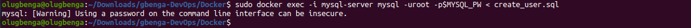

> ### Connecting to the MySQL server from a second container running the MySQL client utility

- Run the MySQL Client Container:

  ```
  docker run --network tooling_app_network --name mysql-client -it --rm mysql mysql -h mysqlserverhost -u  -p
  ```

  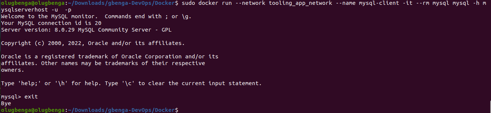

  - --name gives the container a name
  - -it runs in interactive mode and Allocate a pseudo-TTY
  - --rm automatically removes the container when it exits
  - --network connects a container to a network
  - -h a MySQL flag specifying the MySQL server Container hostname
  - -u user created from the SQL script
  - admin username-for-user-created-from-the-SQL-script-create_user.sql
  - -p password specified for the user created from the SQL script

> ### Prepare database schema

- Clone the Tooling-app repository from:

  ```
  git clone https://github.com/darey-devops/tooling.git
  ```

  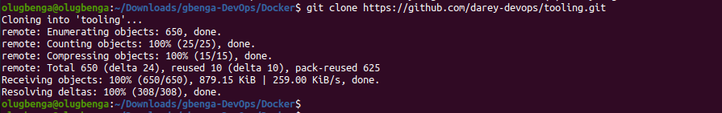

- On the terminal, export the location of the SQL file

  ```
  export tooling_db_schema=../html/tooling_db_schema.sql
  ```

- Verify that the path is exported

- Use the SQL script to create the database and prepare the schema. With the docker exec command, you can execute a command in a running container.

  ```
  docker exec -i mysql-server mysql -uroot -p$MYSQL_PW < $tooling_db_schema
  ```

  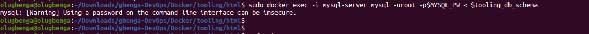

- Update the .env file with connection details to the database

  ```
  edit this file
  sudo vi .env

  MYSQL_IP=mysqlserverhost
  MYSQL_USER=username
  MYSQL_PASS=client-secrete-password
  MYSQL_DBNAME=toolingdb
  ```

- Run the Tooling App

Containerization of an application starts with creation of a file with a special name - 'Dockerfile' (without any extensions). This can be considered as a 'recipe' or 'instruction' that tells Docker how to pack your application into a container. In this project, you will build your container from a pre-created Dockerfile, but as a DevOps, you must also be able to write Dockerfiles.

- Ensure you are inside the directory "tooling" that has the file Dockerfile and build your container :

  ```
  docker build -t tooling:0.0.1 .
  ```

  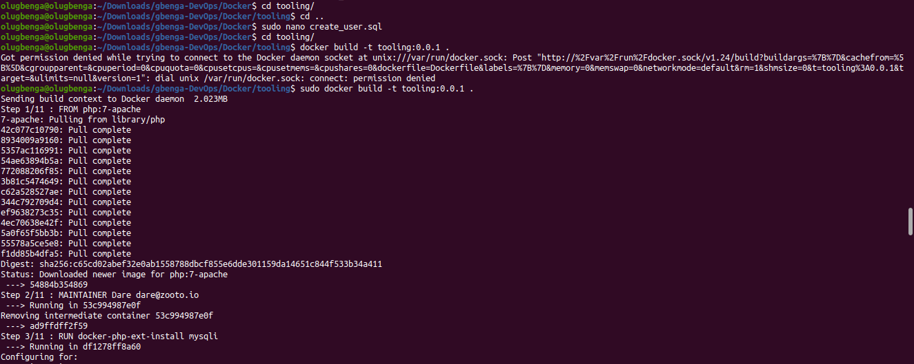

- Run the container

  ```
  docker build -t tooling:0.0.1 .
  ```

  

-

If everything works, you can open the browser and type _**http://localhost:8085**_

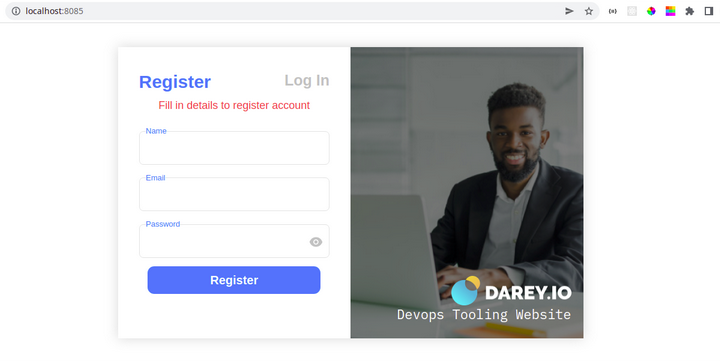
