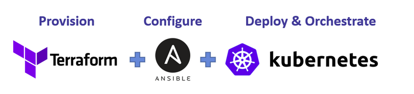
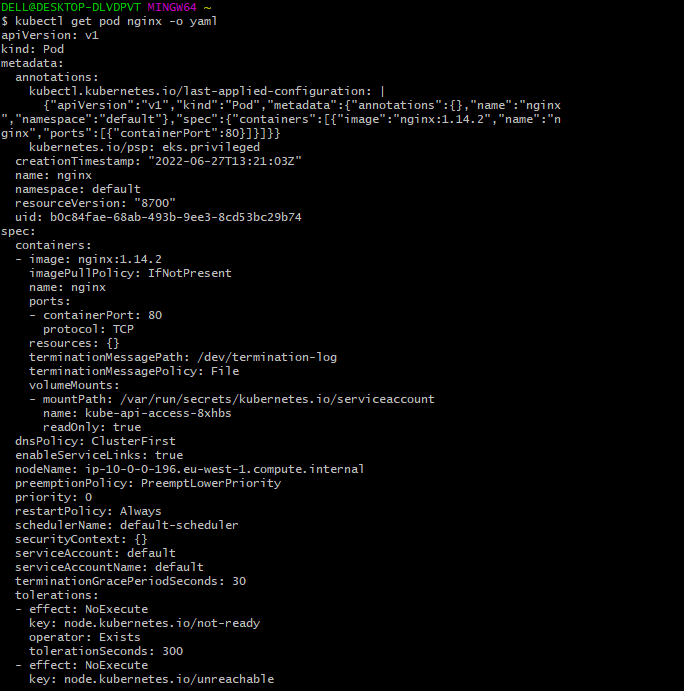
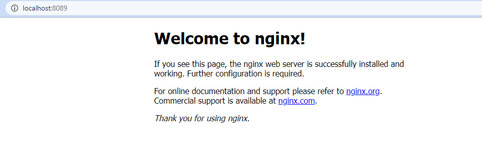
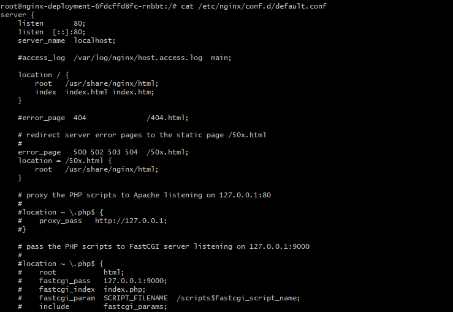
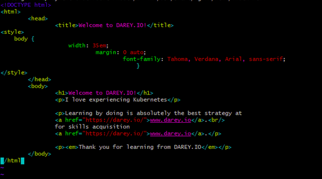
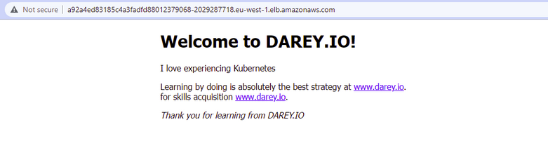

# PROJECT 22: DEPLOYING APPLICATIONS INTO KUBERNETES CLUSTER

Within this project we are going to learn and see in action following:

 

1. Deployment of software applications using [YAML](https://en.wikipedia.org/wiki/YAML) manifest files with following K8s objects:

- Pods
- ReplicaSets
- Deployments
- StatefulSets
- Services (ClusterIP, NodeIP, Loadbalancer)
- Configmaps
- Volumes
- PersistentVolumes
- PersistentVolumeClaims

2. Difference between stateful and stateless applications

- Deploy MySQL as a StatefulSet and explain why

3. Limitations of using manifests directly to deploy on K8s

- Working with [Helm](https://helm.sh/) templates, its components and the most important parts – semantic versioning
- Converting all the _.yaml_ templates into a helm chart

4. Deploying more tools with Helm charts on AWS Elastic [Kubernetes Service (EKS)](https://aws.amazon.com/eks/)

- Jenkins
  - MySQL
  - Ingress Controllers (Nginx)
- Cert-Manager
- Ingress for Jenkins
- Ingress for the actual application

5. Deploy Monitoring Tools

- Prometheus
- Grafana

6. Hybrid CI/CD by combining different tools such as: [Gitlab CICD](https://docs.gitlab.com/ee/ci/), Jenkins. And, you will also be introduced to concepts around [GitOps](https://www.weave.works/technologies/gitops/) using [Weaveworks Flux](https://www.weave.works/oss/flux/).

### Choosing the right Kubernetes cluster set up

When it comes to using a Kubernetes cluster, there is a number of options available depending on the ultimate use of it. For example, if you just need a cluster for development or learning, you can use lightweight tools like [Minikube](https://minikube.sigs.kubernetes.io/docs/start/), or [k3s](https://k3s.io/). These tools can run on your workstation without heavy system requirements. Obviously, there is limit to the amount of workload you can deploy there for testing purposes, but it works exactly like any other Kubernetes cluster.

 

It it a great combination of tools responsible for different parts of your applications:

- **Terraform** for infrastructure provisioning
- **Ansible** for cluster master and worker nodes configuration
- **Kubernetes** for deploying your containerized application and orchestrating the deployment

- Ensured the AWS credentials was well configured, then created an AWS cluster

- Created a POD yml manifest on the master nodes and applied it.

- It displayed the running pods in the cluster

- Ensure the POD's ip address

- Ensure that the SERVICE yaml manifest files access to the pods and enforce the manifest

- Checked the service and port forward it.

- Updated the POD manifest again, applied it and ensured that the port forward command is ran again.

- Created the rs.yaml manifest file for the replica set and applied it.

- Investigated the running pods and checked the replicasets

- Run linux command in the running container

- Looked as the nginx directory

- Reduced the pods to one

- Install vim editor in the only running pod

- Updated the content of the index.html file

- Also, used the browser to view

