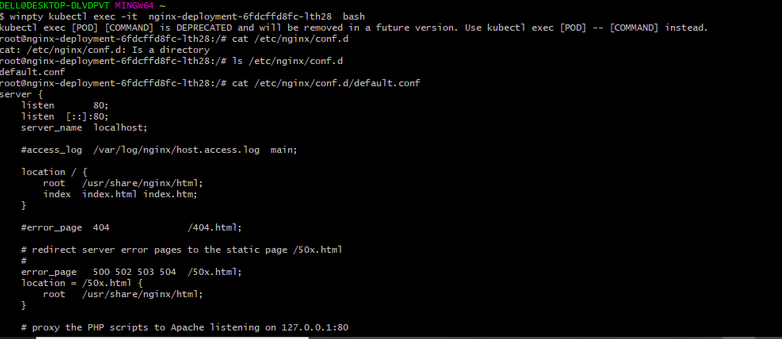
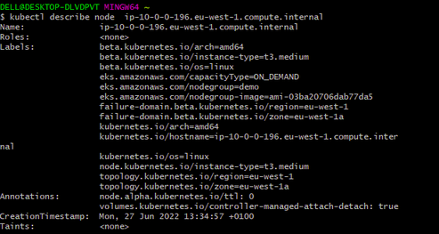
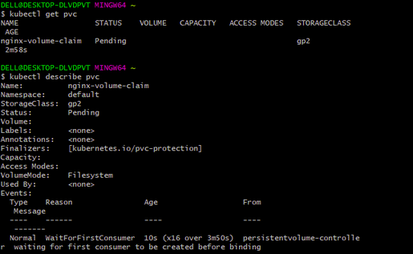
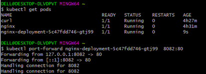

# PROJECT 23: PERSISTING DATA IN KUBERNETES

Volumes

On-disk files in a container are ephemeral, which presents some problems for non-trivial applications when running in containers. One problem is the loss of files when a container crashes. The kubelet restarts the container but with a clean state. A second problem occurs when sharing files between containers running together in a Pod. The Kubernetes volume abstraction solves both of these problems

Docker has a concept of volumes, though it is somewhat looser and less managed. A Docker volume is a directory on disk or in another container. Docker provides volume drivers, but the functionality is somewhat limited.

Kubernetes supports many types of volumes. A Pod can use any number of volume types simultaneously. Ephemeral volume types have a lifetime of a pod, but persistent volumes exist beyond the lifetime of a pod. When a pod ceases to exist, Kubernetes destroys ephemeral volumes; however, Kubernetes does not destroy persistent volumes. For any kind of volume in a given pod, data is preserved across container restarts.

At its core, a volume is a directory, possibly with some data in it, which is accessible to the containers in a pod. How that directory comes to be, the medium that backs it, and the contents of it are all determined by the particular volume type used. This means, you must know some of the different types of volumes available in kubernetes before choosing what is ideal for your particular use case.

Lets have a look at a few of them.

> ### Process carried out

- Update my pod manifest file and apply it.

- Exec into the running pods and confirm the default config file

- Check the running node and confirm availability zone with ip address

- Create a volume in the ready availability zone

- Update the POD manifest file and apply it.

- Confirm storageclass and discovered that VolumeBindingMode is not activated

- Create a file for the persistent-volume-claim and apply it

- Confirm the persistent-volume-claim (pvc), update again and apply.

- Exec into the running container and copy the content into the index.file

- Create config-map.yaml manifest file, a deployment manifest file and apply it.

- Configure the pods and exec into the running pod. Also, check the cm

- Confirm the website index file and restart the deployment

- Check the pods and run port-forward command

- Also, confirm the port on the browser

