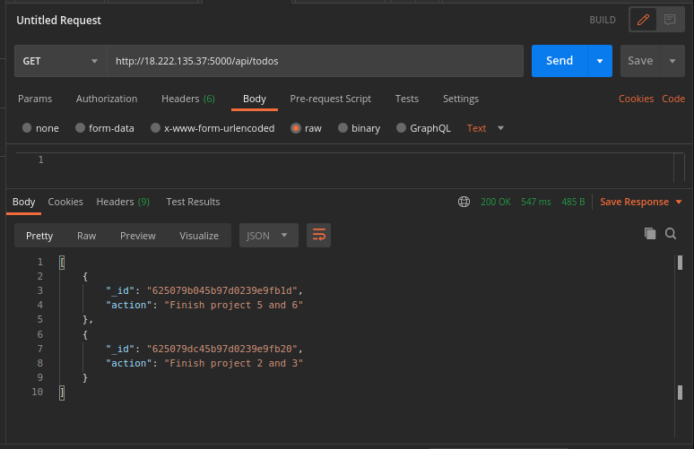

# Project 3 - MERN STACK IMPLEMENTATION

> ## Step 1: Backend Configuration

- Update Ubuntu

  `sudo apt update`

- Upgrade Ubuntu

  `sudo apt upgrade`

- Get the location of Nodejs software from Ubuntu repository

  `curl -sL https://deb.nodesource.com/setup_12.x | sudo -E bash -`

- Install Node.js

  `sudo apt-get install -y nodejs`

- Verify the Node Installation

  `node -v`

- Verify the npm installation

  `npm -v`

## Set main directory for project

- Create a new directory for the To-Do project

  `mkdir Todo`

- Change directory to the Todo folder and initialize the project

  ```
  cd Todo
  npm init
  ```

> ## INSTALL EXPRESSJS

`npm install express`

- Create a file, install dotenv and open file in vim

  ```
  touch index.js
  ls - to check the file
  npm install dotenv
  vim index.js
  ```

- Add code to file index and run using:

  `node index.js`

  

- Check server in the browser by add port 5000 to public ip

  

- Create the routes

  ```
  The routes will:
  create a new task
  display the list of all tasks
  delete a completed task
  ```

- Create directory for the route, change to directory and create a file. The routes folder will be created in main Todo foler

  ```
  mkdir routes
  cd routes
  touch api.js
  ```

  > ## **CREATE MODELS DIRECTORY IN THE MAIN DIRECTORY AND INSTALL MONGOOS**

  `npm install mongoose`

- Create models folder, change to the folder and create a file

  ```
  mkdir models
  cd models
  touch todo.js

  or

  mkdir models && cd models && touch todo.js
  ```

- Add code in the todo file

> **SET UP MONGODB DATABASE**

- Create mongodb account and database

- Create .env file in the root directory

  ```
  cd Todo
  touch .env
  vi .env

  ```

- Add the connection string to access the database

  Ensure to update username, password, network-address and database according to your setup

  `DB = 'mongodb+srv://<username>:<password>@<network-address>/<dbname>?retryWrites=true&w=majority'`

  

- Check routes in API routes using Postman

  `post request`

  

  `get request`

  

  `delete request`

  

> ## **FRONTEND CREATION**

- In the root directory which is the Todo directory

`npx create-react-app client`

- Install concurrently to run more than one command simultaneously from the terminal window

`npm install concurrently --save-dev`

- Install nodemon to run, monitor server and changes in the server

`npm install nodemon --save-dev`

- Edit the package.json file in the root directory to the following below:

```
"scripts": {
"start": "node index.js",
"start-watch": "nodemon index.js",
"dev": "concurrently \"npm run start-watch\" \"cd client && npm start\""
},
```

- Edit package.json in client directory and the other commands

```
cd client
vi package.json
Add the key value pair in the package.json file "proxy": "http://localhost:5000"
```

- Change back to root (Todo) directory and run:

`npm run dev`

Important note: In order to be able to access the application from the Internet you have to open TCP port 3000 on EC2 by adding a new Security Group rule.

- Creating the React components

```
cd client
cd src
mkdir components
cd components
```

- Create three files in the components directory

`touch Input.js ListTodo.js Todo.js`

- Open Input.js and add code

`vi Input.js`

```

  import React, { Component } from 'react';
  import axios from 'axios';

  class Input extends Component {

  state = {
  action: ""
  }

  addTodo = () => {
  const task = {action: this.state.action}

      if(task.action && task.action.length > 0){
        axios.post('/api/todos', task)
          .then(res => {
            if(res.data){
              this.props.getTodos();
              this.setState({action: ""})
            }
          })
          .catch(err => console.log(err))
      }else {
        console.log('input field required')
      }

  }

  handleChange = (e) => {
  this.setState({
  action: e.target.value
  })
  }

  render() {
  let { action } = this.state;
  return (

  <div>
  <input type="text" onChange={this.handleChange} value={action} />
  <button onClick={this.addTodo}>add todo</button>
  </div>
  )
  }
  }

  export default Input
```

- Install Axios in the root (Todo) directory which is a Promise based HTTP client for the browser and node.js. Go back to the Todo directory

  ```

  cd ../..
  npm install axios
  ```

- Go back to components directory

  ```

  cd src/components
  vi ListTodo.js
  ```

  ```

    import React from 'react';

  const ListTodo = ({ todos, deleteTodo }) => {

  return (
  <ul>
  {
  todos &&
  todos.length > 0 ?
  (
  todos.map(todo => {
  return (
  <li key={todo._id} onClick={() => deleteTodo(todo._id)}>{todo.action}</li>
  )
  })
  )
  :
  (
  <li>No todo(s) left</li>
  )
  }
  </ul>
  )
  }
  ```

- Edit the Todo.js also,

  ```

  import React, {Component} from 'react';
  import axios from 'axios';

  import Input from './Input';
  import ListTodo from './ListTodo';

  class Todo extends Component {

  state = {
  todos: []
  }

  componentDidMount(){
  this.getTodos();
  }

  getTodos = () => {
  axios.get('/api/todos')
  .then(res => {
  if(res.data){
  this.setState({
  todos: res.data
  })
  }
  })
  .catch(err => console.log(err))
  }

  deleteTodo = (id) => {

      axios.delete(`/api/todos/${id}`)
        .then(res => {
          if(res.data){
            this.getTodos()
          }
        })
        .catch(err => console.log(err))

  }

  render() {
  let { todos } = this.state;

      return(
        <div>
          <h1>My Todo(s)</h1>
          <Input getTodos={this.getTodos}/>
          <ListTodo todos={todos} deleteTodo={this.deleteTodo}/>
        </div>
      )

  }
  }

  export default Todo;
  ```

- Add codes for styling in both .App.css and .index.css

- Change to Todo directory and run:

  `cd ../..`

  `npm run dev`

  
