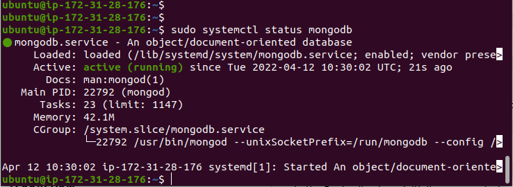
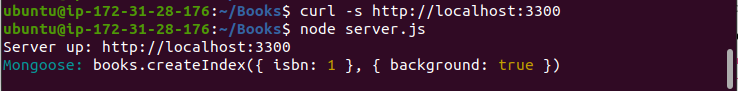
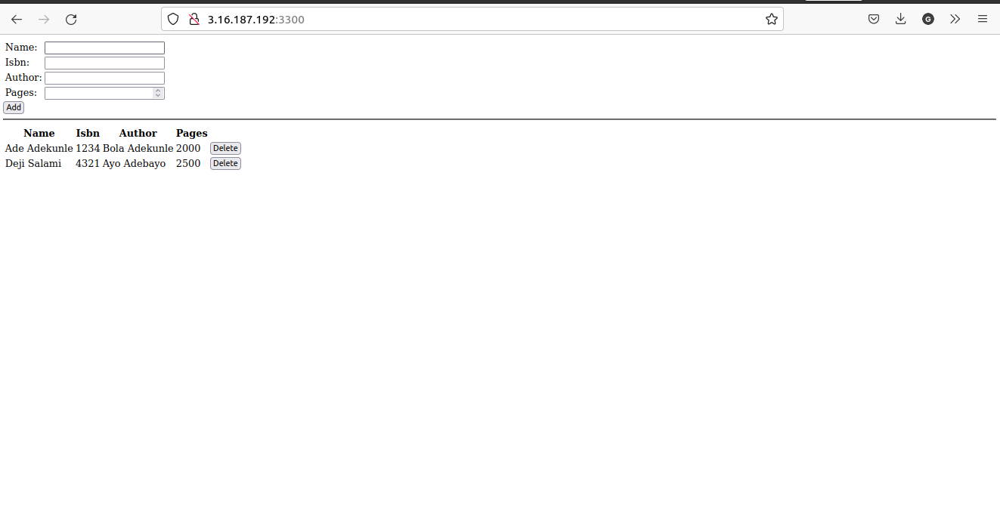

# Project 4 - MEAN STACK IMPLEMENTATION

> ## STEP1: INSTALL NODEJS

- Update Ubuntu

  `sudo apt update`

- Upgrade Ubuntu

  `sudo apt upgrade`

- Add certificates

  ```

  sudo apt -y install curl dirmngr apt-transport-https lsb-release ca-certificates

  curl -sL https://deb.nodesource.com/setup_12.x | sudo -E bash -
  ```

> ## STEP 2: Install MongoDB

- Steps to install the mongodb

  `sudo apt-key adv --keyserver hkp://keyserver.ubuntu.com:80 --recv 0C49F3730359A14518585931BC711F9BA15703C6`

  `echo "deb [ arch=amd64 ] https://repo.mongodb.org/apt/ubuntu trusty/mongodb-org/3.4 multiverse" | sudo tee /etc/apt/sources.list.d/mongodb-org-3.4.list`

  `sudo apt install -y mongodb`

- Start the mongodb server

  `sudo service mongodb start`

- Check that the server is up and running

  `sudo systemctl status mongodb`

  

- NPM is installed when node was added.

- Install body-parser package

  `sudo npm install body-parser`

- Create a folder named Book and change to the directory

  `mkdir Books && cd Books`

- Initialize the npm project in the main Book directory

  `npm init`

- Edit the server.js file in the Book directory

  `vi server.js`

- Add code to the server.js

  ```
  var express = require('express');
  var bodyParser = require('body-parser');
  var app = express();
  app.use(express.static(__dirname + '/public'));
  app.use(bodyParser.json());
  require('./apps/routes')(app);
  app.set('port', 3300);
  app.listen(app.get('port'), function() {
    console.log('Server up: http://localhost:' + app.get('port'));
  });
  ```

> ## STEP 3: INSTALL EXPRESSJS AND SET UP ROUTES TO SERVER

- Install Mongoose in the home directory

  `sudo npm install express mongoose`

- Create a folder app in the book directory and change to the app directory

  `mkdir apps && cd apps`

- In the app folder, create the routes.js

  ```
  touch routes.js
  vi routes.js
  ```

- In the ‘apps’ folder, create a folder named models, change to the directory and create a file named book.js

  ```
  mkdir models && cd models
  touch book.js
  vi book.js
  ```

> ## Step 4 – ACCESS THE ROUTES WITH ANGULARJS

- Change back to the Books folder

  `cd ../..`

- Make a folder named public and change to the directory

  `mkdir public && cd public`

  `touch script.js`

  `vi script.js`

- In the public folder, create a file index.html

  ```
  touch index.html
  vi index.html


  <!doctype html>
  <html ng-app="myApp" ng-controller="myCtrl">
    <head>
      <script src="https://ajax.googleapis.com/ajax/libs/angularjs/1.6.4/angular.min.js"></script>
      <script src="script.js"></script>
    </head>
    <body>
      <div>
        <table>
          <tr>
            <td>Name:</td>
            <td><input type="text" ng-model="Name"></td>
          </tr>
          <tr>
            <td>Isbn:</td>
            <td><input type="text" ng-model="Isbn"></td>
          </tr>
          <tr>
            <td>Author:</td>
            <td><input type="text" ng-model="Author"></td>
          </tr>
          <tr>
            <td>Pages:</td>
            <td><input type="number" ng-model="Pages"></td>
          </tr>
        </table>
        <button ng-click="add_book()">Add</button>
      </div>
      <hr>
      <div>
        <table>
          <tr>
            <th>Name</th>
            <th>Isbn</th>
            <th>Author</th>
            <th>Pages</th>

          </tr>
          <tr ng-repeat="book in books">
            <td>{{book.name}}</td>
            <td>{{book.isbn}}</td>
            <td>{{book.author}}</td>
            <td>{{book.pages}}</td>

            <td><input type="button" value="Delete" data-ng-click="del_book(book)"></td>
          </tr>
        </table>
      </div>
    </body>
  </html>
  ```

- Change to the Books folder

  `cd ..`

- Start the server by running

  `node server.js`

  

- Edit the inbound rules and open the tcp port 3300 in my AWS Web Console for the EC2 instance

  ```
  custom tcp
  port - 3300
  anywhere ip
  ```

- Check the application in the browser

  

- Resources used.

  Website used for creating users and groups [Link](https://www.techrepublic.com/article/how-to-create-users-and-groups-in-linux-from-the-command-line/).

  Website used to change user password in linux [Link](https://www.tomshardware.com/how-to/change-passwords-in-linux).
