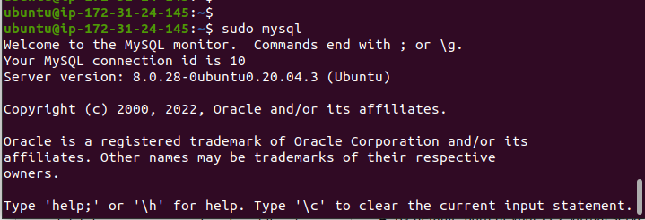
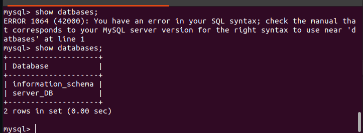

# CLIENT/SERVER ARCHITECTURE USING MYSQL RELATIONAL DATABASE MANAGEMENT SYSTEM (DBMS).

> Create and configure two Linux-based virtual servers (EC2 instances in AWS).

- Server A name

  `mysql server`

- Install MySQL server in the EC2 instance for the server using:

  `sudo apt install mysql-server`

- Secure the MySQL connection

  `sudo mysql-secure-installation`

- Create a user and password in MySQL server

  `CREATE USER 'example_user'@'%' IDENTIFIED WITH mysql_native_password BY 'password';`

- Grant permission to the user

  `GRANT ALL ON example_database.* TO 'example_user'@'%';`

- Server B name

  `mysql client`

- Install the MySQL client

  `sudo apt install mysql-client`

- MySQL server connected

  

- MySQL client connected to the MySQL server

  

- Resources

  [How To Install MySQL on Ubuntu 20.04](https://www.digitalocean.com/community/tutorials/how-to-install-mysql-on-ubuntu-20-04)

  [Install MySQL on Ubuntu 20.04 LTS Linux](https://linuxconfig.org/install-mysql-on-ubuntu-20-04-lts-linux)
