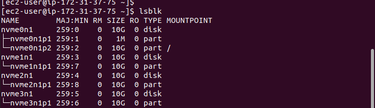
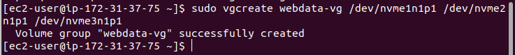
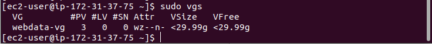

# PROJECT 6: WEB SOLUTION WITH WORDPRESS

> ## STEP 1: PREPARE THE WEB SERVER

- Create 2 Red Hat instances

  - The first Red Hat instance is for the web server and the other Red Hat instance is for the database sever
  - Create 3 volumes for the web server, one at a time
  - Click on create volume to create the volumes
  - Each volume will have a size of 10GB and must be in the availability region of the web server

- Login to the web server

  List all the block

  `lsblk`

- Check the all the mounts and free space on the web server using

  `df -h`

- Create a partition on one of the disk and follow the same steps for all the 3 disks

  ```

  sudo gdisk /dev/nvme1n1
  type n
  press enter three times to accept the defaults
  type 8e00
  p to preview
  w to write
  y to complete the process
  ```

- Check the new created partitions using

  `lsblk`

  

- Install the lvm2 package to use the command to check available partitions

  ```
  sudo yum install lvm2
  sudo lvmdiskscan
  ```

- Create 3 disks with physical volumes using the pvcreate command and verify the physical volumes

  ```
  sudo pvcreate /dev/xvdf1
  sudo pvcreate /dev/xvdg1
  sudo pvcreate /dev/xvdh1

  or

  sudo pvcreate /dev/xvdf1 /dev/xvdg1 /dev/xvdh1

  sudo pvs
  ```

  
  

- Add all 3 physical volumes PVs to form a volume group VG using vgcreate. Name it webdata-vg and check the volume group

  `sudo vgcreate webdata-vg /dev/xvdf1 /dev/xvdg1 /dev/xvdh1`

  `sudo vgs`

  
  

- Create 2 logical volumes using the lvcreate command. apps-lv (Use half of the PV size), and logs-lv Use the remaining space of the PV size. NOTE: apps-lv will be used to store data for the Website while, logs-lv will be used to store data for logs.

  ```
  sudo lvcreate -n apps-lv -L 14G webdata-vg
  sudo lvcreate -n logs-lv -L 14G webdata-vg
  ```

- Verify the logical volumes using

  `sudo lvs`

- Verify the entire setup

  ```
  sudo vgdisplay -v #view complete setup - VG, PV, and LV
  sudo lsblk
  ```

- Format the logical volumes using the mkfs with the ext4 filesystem

  ```
  sudo mkfs -t ext4 /dev/webdata-vg/apps-lv
  sudo mkfs -t ext4 /dev/webdata-vg/logs-lv
  ```

- Create the directory to store the website files

  `sudo mkdir -p /var/www/html`

- Create the directory to store backup of the logs data

  `sudo mkdir -p /home/recovery/logs`

- Mount directory to store the website files on apps-lv logical volume prepared for it

  `sudo mount /dev/webdata-vg/apps-lv /var/www/html/`

- Use rsync utility to backup all the files in the log directory /var/log into /home/recovery/logs (This is required before mounting the file system)

  `sudo rsync -av /var/log/. /home/recovery/logs/`

- Mount /var/log on logs-lv logical volume. (Note that all the existing data on /var/log will be deleted.

  `sudo mount /dev/webdata-vg/logs-lv /var/log`

- Restore log files back into /var/log directory

  `sudo rsync -av /home/recovery/logs/. /var/log`

- Update /etc/fstab file so that the mount configuration will persist after restart of the server.

- Check the UUID of the device that will be used to update the /etc/fstab file.

  `sudo blkid`

- Copy the UUID and edit /etc/fstab file

  ```
  sudo vi /etc/fstab

  add the UUIDs and add comment to show that it is for wordpress
  UUID=5a711846-1d03-41d4-81f1-803a2e5f4c9f /var/www/html ext4 defaults 0 0
  UUID=6349f392-b3c1-4d9f-b61d-c60de229fdd6 /var/log      ext4 defaults 0 0
  ```

- Run command to show ensure there is no error. If the command returns anything, it means there is error else all is fine.

  `sudo mount -a`

- Reload the daemon to keep changes

  `sudo system daemon-reload`

- Verify the set up using

  `df -h`

> ## STEP 2: PREPARE THE DATABASE SERVER

- The database server is prepared the same way. However, instead of apps-lv, we use db-lv and we mount it to /db directory instead of /var/www/html

- No logs directory is needed for the database server, hence it is not created.

> ## STEP 3: INSTALL MYSQL ON THE DB SERVER EC2

- Update the repository

  `sudo yum -y update`

- Install the Mysql-Server on the Database Server

  `sudo yum install mysql-server -y`

  `sudo mysql_secure_installation`

- Login into mysql

  `sudo mysql`

- Create a database

  `create database wordpress;`

- Create a user and password in MySQL server

  `CREATE USER 'example_user'@'%' IDENTIFIED WITH mysql_native_password BY 'password';`

- Grant permission to the user

  `GRANT ALL ON example_database.* TO 'example_user'@'%';`

- Flush privileges to save the changes made

  `flush privileges;`

- Edit the configure file of mysql so it can be reached for anywhere at the development level. This is not the case for production

  ```
  sudo vi /etc/my.cnf
  add - [mysqld]
  bind-address=0.0.0.0
  ```

  

> ## STEP 4: INSTALL WORDPRESS ON WEB SERVER

- Update the repository

  `sudo yum -y update`

  Note: `yum` is used in Red Hat instead `apt` used in Ubuntu and `-y` accepts all the defaults

- Install wget, Apache and it's dependencies.

  `sudo yum -y install wget httpd php php-mysqlnd php-fpm php-json`

- Start Apache

  ```
  sudo systemctl enable httpd
  sudo systemctl start httpd
  ```

- Install PHP and it's dependencies

  ```
  sudo yum install https://dl.fedoraproject.org/pub/epel/epel-release-latest-8.noarch.rpm
  sudo yum install yum-utils http://rpms.remirepo.net/enterprise/remi-release-8.rpm
  sudo yum module list php
  sudo yum module reset php
  sudo yum module enable php:remi-7.4
  sudo yum install php php-opcache php-gd php-curl php-mysqlnd
  sudo systemctl start php-fpm
  sudo systemctl enable php-fpm
  sudo setsebool -P httpd_execmem 1
  ```

- Restart Apache

  `sudo systemctl restart httpd`

- Download wordpress and copy wordpress to /var/www/html

  ```
  mkdir wordpress
  cd wordpress
  sudo wget http://wordpress.org/latest.tar.gz
  sudo tar xzvf latest.tar.gz
  sudo rm -rf latest.tar.gz
  sudo cp wordpress/wp-config-sample.php wordpress/wp-config.php
  sudo cp -R wordpress/. /var/www/html
  cd /var/www/html
  sudo yum install mysql-server to act as client to reach the database server.
  sudo systemctl start mysqld
  sudo systemctl enable mysqld
  sudo vi wp-config.php

  once the file is open in vim
  edit database name created in db_server, username in db_server, password in db_server and the private ip address of the db_server

  sudo systemctl restart httpd - to reload and keep changes
  ```

- To confirmt the Apache is working, check the ip address on the browser

  

- Disable the apache default page using the command and restart the httpd

  ```
  sudo mv /etc/httpd/conf.d/welcome.conf /etc/httpd/conf.d/welcome.backup
  sudo systemctl restart httpd
  ```

- Configure SELinux Policies

  ```
  sudo chown -R apache:apache /var/www/html/wordpress
  sudo chcon -t httpd_sys_rw_content_t /var/www/html/wordpress -R
  sudo setsebool -P httpd_can_network_connect=1
  ```

> ## STEP 5: CONFIGURE WORDPRESS TO CONNECT TO REMOTE DATABASE

- Added private ip address of database to the webserver security group

- Login to MYSQL remotely from the backend

  `sudo mysql -u admin -p -h <DB-Server-Private-IP-address>`

  

- Access wordpress from the browser by checking the ip address again:

  `http://<web-server-public-address>`

  

  

- Resource

  [YouTube](https://www.youtube.com/watch?v=fJnjuG-CK4g)
