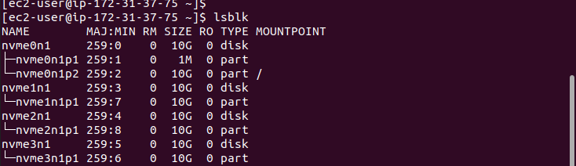
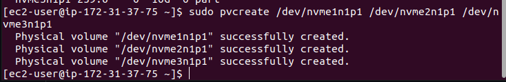
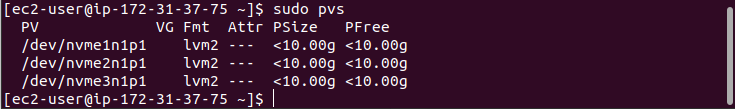
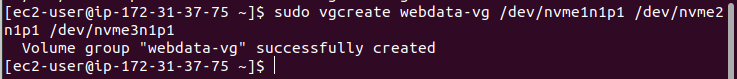
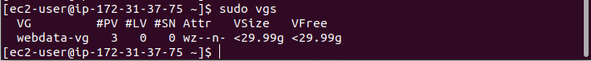

# PROJECT 7: DEVOPS TOOLING WEBSITE SOLUTION

- Create 2 Red Hat instances

  - The first Red Hat instance is for the web server and the other Red Hat instance is for the database sever
  - Create 3 volumes for the web server, one at a time
  - Click on create volume to create the volumes
  - Each volume will have a size of 10GB and must be in the availability region of the web server

- Login to the web server

  List all the block

  `lsblk`

- Check the all the mounts and free space on the web server using

  `df -h`

- Create a partition on one of the disk and follow the same steps for all the 3 disks

  ```

  sudo gdisk /dev/nvme1n1
  type n
  press enter three times to accept the defaults
  type 8e00
  p to preview
  w to write
  y to complete the process
  ```

- Check the new created partitions using

  `lsblk`

  

- Install the lvm2 package to use the command to check available partitions

  ```
  sudo yum install lvm2
  sudo lvmdiskscan
  ```

- Create 3 disks with physical volumes using the pvcreate command and verify the physical volumes

  ```
  sudo pvcreate /dev/xvdf1
  sudo pvcreate /dev/xvdg1
  sudo pvcreate /dev/xvdh1

  or

  sudo pvcreate /dev/xvdf1 /dev/xvdg1 /dev/xvdh1

  sudo pvs
  ```

  
  

- Add all 3 physical volumes PVs to form a volume group VG using vgcreate. Name it webdata-vg and check the volume group

  `sudo vgcreate webdata-vg /dev/xvdf1 /dev/xvdg1 /dev/xvdh1`

  `sudo vgs`

  
  

- Create 2 logical volumes using the lvcreate command. apps-lv (Use half of the PV size), and logs-lv Use the remaining space of the PV size. NOTE: apps-lv will be used to store data for the Website while, logs-lv will be used to store data for logs.

  ```
  sudo lvcreate -n apps-lv -L 14G webdata-vg
  sudo lvcreate -n logs-lv -L 14G webdata-vg
  ```

- Verify the logical volumes using

  `sudo lvs`

- Verify the entire setup

  ```
  sudo vgdisplay -v #view complete setup - VG, PV, and LV
  sudo lsblk
  ```

- Format the logical volumes using the mkfs with the nfs filesystem

  ```
  sudo mkfs -t nfs /dev/webdata-vg/lv-apps
  sudo mkfs -t nfs /dev/webdata-vg/lv-logs
  sudo mkfs -t nfs /dev/webdata-vg/lv-opt
  ```