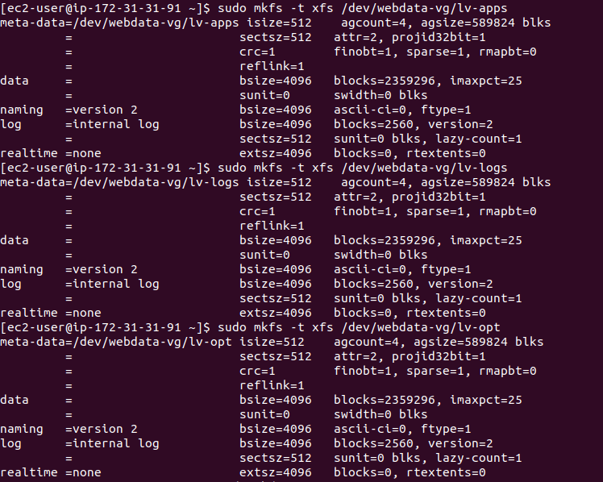
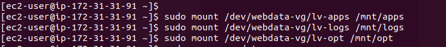
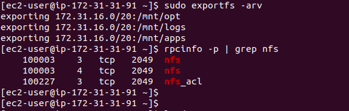

# PROJECT 7: DEVOPS TOOLING WEBSITE SOLUTION

> ## PREPARE NFS SERVER

- Create 2 Red Hat instances

  - The first Red Hat instance is for the web server and the other Red Hat instance is for the database sever
  - Create 3 volumes for the web server, one at a time
  - Click on create volume to create the volumes
  - Each volume will have a size of 10GB and must be in the availability region of the web server

- Login to the web server

  List all the block

  `lsblk`

- Check the all the mounts and free space on the web server using

  `df -h`

- Create a partition on one of the disk and follow the same steps for all the 3 disks

  ```

  sudo gdisk /dev/nvme1n1
  type n
  press enter three times to accept the defaults
  type 8e00
  p to preview
  w to write
  y to complete the process
  ```

- Check the new created partitions using

  `lsblk`

  

- Install the lvm2 package to use the command to check available partitions

  ```
  sudo yum install lvm2
  sudo lvmdiskscan
  ```

- Create 3 disks with physical volumes using the pvcreate command and verify the physical volumes

  ```
  sudo pvcreate /dev/xvdf1
  sudo pvcreate /dev/xvdg1
  sudo pvcreate /dev/xvdh1

  or

  sudo pvcreate /dev/xvdf1 /dev/xvdg1 /dev/xvdh1

  sudo pvs
  ```

- Add all 3 physical volumes PVs to form a volume group VG using vgcreate. Name it webdata-vg and check the volume group

  `sudo vgcreate webdata-vg /dev/xvdf1 /dev/xvdg1 /dev/xvdh1`

  `sudo vgs`


- Create 2 logical volumes using the lvcreate command. apps-lv (Use half of the PV size), and logs-lv Use the remaining space of the PV size. NOTE: apps-lv will be used to store data for the Website while, logs-lv will be used to store data for logs.

  ```
  sudo lvcreate -n lv-apps -L 9G webdata-vg
  sudo lvcreate -n lv-logs -L 9G webdata-vg
  sudo lvcreate -n lv-opt -L 9G webdata-vg
  ```

- Verify the logical volumes using

  `sudo lvs`

- Verify the entire setup

  ```
  sudo vgdisplay -v #view complete setup - VG, PV, and LV
  sudo lsblk
  ```

- Format the logical volumes using the mkfs with the nfs filesystem

  ```
  sudo mkfs -t xfs /dev/webdata-vg/lv-apps
  sudo mkfs -t xfs /dev/webdata-vg/lv-logs
  sudo mkfs -t xfs /dev/webdata-vg/lv-opt
  ```
  
  - 


- Create mount points

  ```
  sudo mkdir /mnt/apps
  sudo mkdir /mnt/logs
  sudo mkdir /mnt/opt
  ```

- Create mount points on /mnt directory for the logical volumes, mount volume and confirm creation

  ```
  sudo mount /dev/webdata-vg/lv-apps /mnt/apps
  sudo mount /dev/webdata-vg/lv-logs /mnt/logs
  sudo mount /dev/webdata-vg/lv-opt /mnt/opt

  df -h
  ```



- Update the changes in the fstab file

  ```
  sudo blkid
  copy UUID
  sudo vi /etc/fstab
  ```

- Verify changes and run command to keep changes

  ```
  sudo mount -a
  sudo systemctl daemon-reload
  ```

- Install NFS Server and configure it to start on reboot and make sure it is running

  ```
  sudo yum -y update
  sudo yum install nfs-utils -y
  sudo systemctl start nfs-server.service
  sudo systemctl enable nfs-server.service
  sudo systemctl status nfs-server.service
  ```

- Export the mounts webserver subnet cidr to connect as clients

  

- Set up permission to allow the Web Server to read, write and execute files on NFS

  ```
  sudo chown -R nobody: /mnt/apps
  sudo chown -R nobody: /mnt/logs
  sudo chown -R nobody: /mnt/opt
  sudo chmod -R 777 /mnt/apps
  sudo chmod -R 777 /mnt/logs
  sudo chmod -R 777 /mnt/opt
  sudo systemctl restart nfs-server.service
  ```

- Configure access to NFS for clients within the same subnet

  ```
  sudo vi /etc/exports
  /mnt/apps 172.31.16.0/20(rw,sync,no_all_squash,no_root_squash)
  mnt/logs 172.31.16.0/20(rw,sync,no_all_squash,no_root_squash)
  /mnt/opt 172.31.16.0/20(rw,sync,no_all_squash,no_root_squash)

  Esc + :wq!
  sudo exportfs -arv
  ```

- Check which port is used by NFS and open it using Security Groups

  

- Open the following ports for NFS server to be accessible from the client

  `TCP 111, UDP 111, UDP 2049, TCP 2049`

> ## CONFIGURE THE DATABASE SERVER

- Create an Ubuntu instance for database

  `sudo apt update`

- Install the Mysql-Server on the Database Server

  `sudo apt install mysql-server`

- Create a database

  `create database tooling;`

- Create a user and password in MySQL server

  `CREATE USER 'webaccess'@'%' IDENTIFIED WITH mysql_native_password BY 'password';`

- Grant permission to the user

  `GRANT ALL ON tooling.* TO 'webaccess'@'%';`

- Flush privileges to save the changes made

  `flush privileges;`
