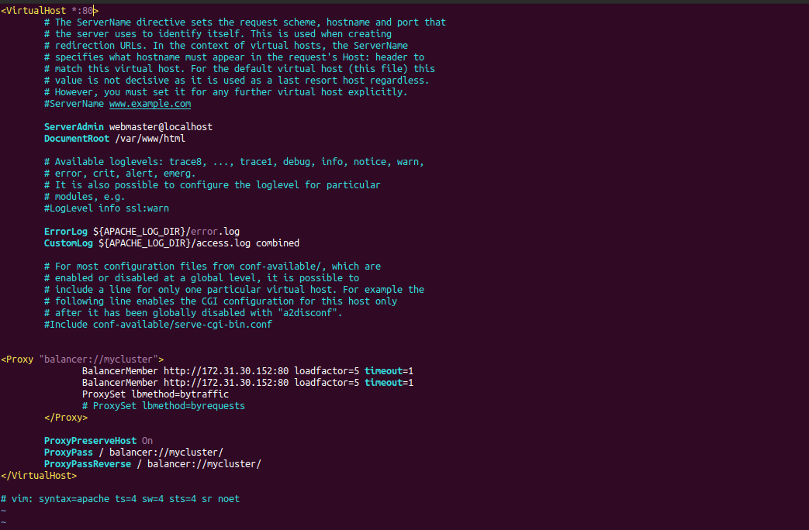
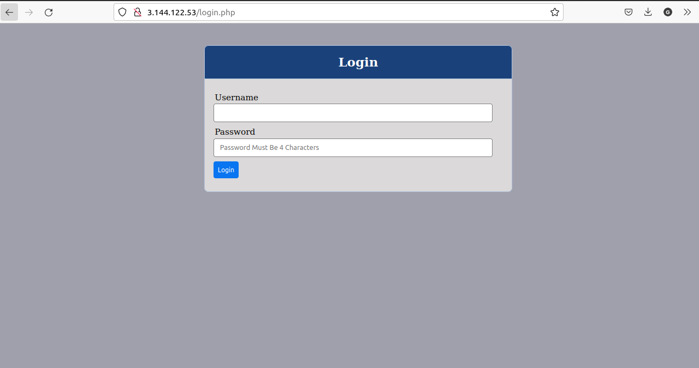

# PROJECT 8: LOAD BALANCER SOLUTION WITH APACHE


> ## Prerequisites for this project

- Two RHEL8 Web Servers
- One MySql Database Server (based on Ubuntu 20.04)
- One RHEL8 NFS Server

> ## CONFIGURE APACHE AS A LOAD BALANCER

- Create an Ubuntu Server 20.04 EC2 instance and name it Project-8-apache-lb

  - Open TCP port 80 for inbound rule in the security group

- Install Apache Load Balancer on Project-8-apache-lb server and configure it to point traffic coming to LB to both Web Servers:

  ```
  #Install apache2
  sudo apt update
  sudo apt install apache2 -y
  sudo apt-get install libxml2-dev

  #Enable following modules:
  sudo a2enmod rewrite
  sudo a2enmod proxy
  sudo a2enmod proxy_balancer
  sudo a2enmod proxy_http
  sudo a2enmod headers
  sudo a2enmod lbmethod_bytraffic

  #Restart apache2 service
  sudo systemctl restart apache2
  ```

- Make sure apache2 is up and running by using:

  `sudo systemctl status apache2`

- Configure the load balancing by edit the system file and opening it in Vim IDE:

  `sudo vi /etc/apache2/sites-available/000-default.conf`

  - #Add this configuration into this section <VirtualHost \*:80>

  ```
  <Proxy "balancer://mycluster">
               BalancerMember http://<WebServer1-Private-IP-Address>:80 loadfactor=5 timeout=1
               BalancerMember http://<WebServer2-Private-IP-Address>:80 loadfactor=5 timeout=1
               ProxySet lbmethod=bytraffic
               # ProxySet lbmethod=byrequests
  </Proxy>

  ProxyPreserveHost On
  ProxyPass / balancer://mycluster/
  ProxyPassReverse / balancer://mycluster/
  ```

  

- Restart the apache server using

  `sudo systemctl restart apache2`

- Note: bytraffic balancing method will distribute incoming load between your Web Servers according to current traffic load. We can control in which proportion the traffic must be distributed by loadfactor parameter.

- Verify that our configuration works – try to access your LB’s public IP address or Public DNS name from your browser:

  

- Sometimes it is tedious to remember and switch between IP addresses, especially if you have a lot of servers under your management. Hence, we configure local domain name resolution. This approach is not very scalable, so we will only add it as a note. To achieve this, we will edit the **/etc/hosts** file using Vim IDE.

  `sudo vi /ete/hosts`

  ```
  #Add 2 records into this file with Local IP address and arbitrary name for both of your Web Servers

  <WebServer1-Private-IP-Address> Web1
  <WebServer2-Private-IP-Address> Web2
  ```

- Now we can update the LB config the names instead of the ip addresses.

  ```
  BalancerMember http://Web1:80 loadfactor=5 timeout=1
  BalancerMember http://Web2:80 loadfactor=5 timeout=1
  ```
