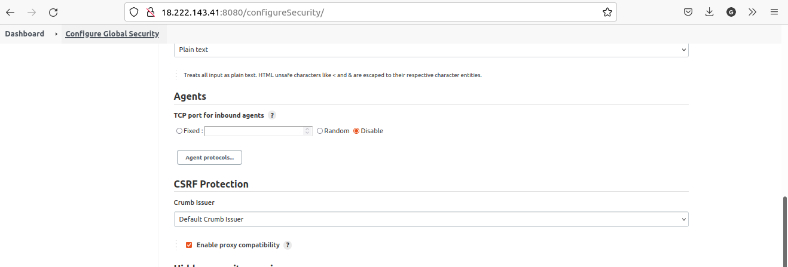

# PROJECT 9: CONTINUE INTEGRATION PIPELINE FOR TOOLING WEBSITE

- In this project we will automate the part of our routine tasks with a free and open source automation server - Jenkins. It is one of the most popular CI/CD tools, it was created by a former Sun Microsystems developer Kohsuke Kawaguchi and the project originally had a named "Hudson".

- Acording to Circle CI, Continuous integration (CI) is a software development strategy that increases the speed of development while ensuring the quality of the code that teams deploy.

> ## TASK

- We are enchancing architecture prepared in Project 8 by adding a Jenkins server, configure a job to automatically deploy source codes changes from Git to NFS Server.

  

> ## INSTALL AND CONFIGURE JENKINS SERVER

- Create an AWS EC2 server based on Ubuntu server 20.04 LTS and name it "Jenkins" with TCP port 8080 opened in the inbound rule

- Install JDK

  ```
  sudo apt update
  sudo apt install default-jdk-headless
  ```

- Install Jenkins

  ```
  wget -q -O - https://pkg.jenkins.io/debian-stable/jenkins.io.key | sudo apt-key add -
  sudo sh -c 'echo deb http://pkg.jenkins.io/debian-stable binary/ > /etc/apt/sources.list.d/jenkins.list'
  sudo apt update
  sudo apt-get install jenkins
  ```

- Verify Jenkins is up and running

  `sudo systemctl status jenkins`

  

- Perform initial Jenkins setup from the browswer by accessing:

  - Note: open port 8080 by creating a TCP inbound rule in the security group

  `http://jenkins-server-public-ip-address:8080`

  

- Retrieve the administrator password from the server using:

  `sudo cat /var/lib/jenkins/secrets/initialAdminPassword`

  

- Enter the password in the admin page and click continue

  

- Click Install suggested plugins

  

- Create admin account after plugins installation is complete.

  

- Click on save and continue

  

- Jenkins is fully ready for deployment and use

  

> ## CONFIGURE JENKINS TO RETRIEVE SOURCE CODE FROM GITHUB USING WEBHOOKS

- We will configure a simple Jenkins job/project that will be triggered by GitHub webhooks and will execute a build task to retrieve codes from GitHub and store it locally on Jenkins server.

- Enable webhooks in GitHub repository settings for the tooling forked repository in project 7

  

- Go to Jenkins web console, click "New Item" and create a "Freestyle project"

  

- Connect to the GitHub repository for tooling used in project 7, click on drop down beside code, select 'https', and copy link for the repository.

  

- In configuration of the Jenkins freestyle project choose Git repository, and provide the link to your Tooling GitHub repository and your credentials (user/password) so Jenkins could access files in the repository.

  

- If you notice, I did not add my GitHub credentials but it later gave an issue. Hence, you can get an error like this:

  `an internal error occurred during form field validation (http 403). please reload the page and if the problem persists, ask the administrator for help`

- This is took me like 2 days to figure out. You can correct this error:

  ```
  Go to your Jenkins Dashboard
  Click Manage Jenkins
  Select Configure Global security
  Look for heading "CSRF Protection"
  Check the "Enable proxy compatibility"
  ```

  

- Save the configuration and try to run the build. This is a manually build. Click "Build Now" button, if you have configured everything correctly, the build will be successfull and you will see it under #1

  

- Once the image above is seen, the build is complete. Click on the drop down arrow beside the #1 and select Console output show if everything is successful.

  

- Click "Configure" on the job/project and add these two configuration

  - Check the "GitHub hook trigger for GITScm pooling" to allow changes from GitHub.

  - Please note that if you could not finish your project on one sitting, you need to change the ip address on the GitHub webhook.

  

- Once the "Archive the artifacts" is selected, type 2 asterisks (\*\*) and save

- Make some change in any file in the GitHub repository (e.g. README.MD file) and push the changes to the master branch. A new build will be launched automatically and you see the results.

  

> You have now configured an automated Jenkins job that receives files from GitHub by webhook trigger (this method is considered as ‘push’ because the changes are being ‘pushed’ and files transfer is initiated by GitHub). There are also other methods: trigger one job (downstreadm) from another (upstream), poll GitHub periodically and others.

- By default, the artifacts are stored on Jenkins server locally

  `ls /var/lib/jenkins/jobs/tooling_github/builds/<build_number>/archive/`

> ## CONFIGURE JENKINS TO COPY FILES TO NFS SERVER VIA SSH

- Now we have our artifacts saved locally on Jenkins server, the next step is to copy them to our NFS server to /mnt/apps directory.

  _Jenkins is a highly extendable application and there are 1400+ plugins available. We will need a plugin that is called "Publish Over SSH"._

- Install "Publish Over SSH"

  _On main dashboard select "Manage Jenkins" and choose "Manage Plugins" menu item.
  On "Available" tab search for "Publish Over SSH" plugin and install it_

  _After installation you should see this:_

  

- Configure the job/project to copy artifacts over to the NFS Server

  _On main dashboard select "Manage Jenkins" and choose "Configure System" menu item_

  _Scroll down to Publish over SSH plugin configuration section and configure it to be able to connect to your NFS server:_

  _Passphase should be empty_

  _Path to key should be empty_

  _key: open your .pem key using an text editor and copy the content in the key textbox_

  _Click on add SSH Server to add the details_

  _Name: You can use any name of your choice but it is better to use something descriptive_

  _Hostname: this will be the private ip address of your NFS Server_

  _username: ec2-user (since NFS server is based on EC2 with RHEL 8)_

  _Remote directory: /mnt/apps since our Web Servers use it as a mointing point to retrieve files from the NFS server_

- Test the configuration and make sure the connection returns Success.

  _Remember, that TCP port 22 on NFS server must be open to receive SSH connections._

  

- Save the configuration. Then open your Jenkins job/project configuration page and add another one "Post-build Action"

  
